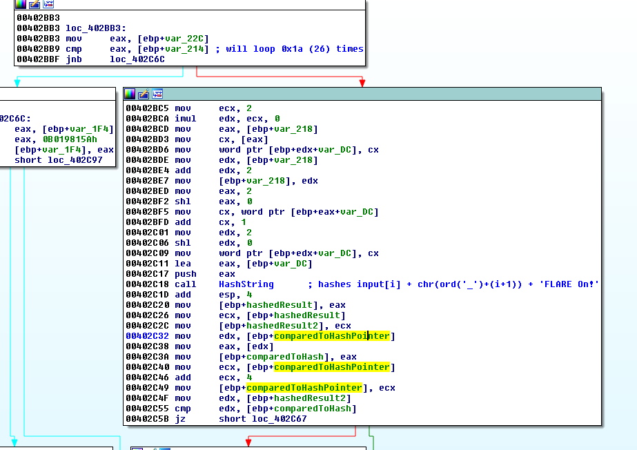

## Flare-On CTF 2016
# Challenge 03 : Unknown

As usual, let's start with the Strings tab in IDA Pro. I renamed some functions to represent what they do.


We see a interesting string "No rite arguments" which is what is displayed if the execuable is run.

X-ref it and it will lead to a huge function. Actually, most of this function is not important. I will just highlight the important parts.

First, at the start of the function


It checks that exactly 1 argument is supplied. It then substrings the current filename from the last occurance of the 'r' character. This string is then hashed using some kind of hashing function which returns a 4 byte hash


Also, note that a string constant "__FLARE On!" is created

Now, let's jump back to the end of the function where the "No rite arguments" string is used. The most important part of this function is the part just above it.



This code hashes the input argument in the following way
- extracts each char of the input
- creates a string in the format input[i] + chr(ord('_')+(i+1)) + 'FLARE On!'
 - 1st char = input[0] + '`FLARE On!'
 - 2nd char = input[1] + 'aFLARE On!'
 - 3rd char = input[2] + 'bFLARE On!'
 - and so on...
- hash the resulting string

The resulting hash is compared to an array of target hashes. If all the hashes are correct then the good "You make good arghuments" string is displayed. Also this loop runs for 0x1a times, meaning the correct input should be 0x1a(26) characters long too.

The goal now is to figure out what the target hashes are. Let's put a breakpoint at offset 0x2c32 and check.

As this executable is expecting input arguments, you can change the input arguments in x64dbg using "Debug->Change Command Line". I set it to the full alphabet order as it is expecting 26 characters


Step over the instruction and display edx in the "dump" view.


There we see exactly 26 target hashes. Time to do some brute forcing.

First of all, I reimplemented the hashString function in php

```php
function hashString($data){
	$res = 0;
	for ($i=0; $i<strlen($data); $i++){
		$cur = ord($data[$i]);
		
		$res = ($res * 0x25) & 0xffffffff;
		$res = ($res + $cur) & 0xffffffff;
	}
	
	return $res;
}
```

I then wrote a brute force function. I am assuming the input needs to be typed into a command line, thus I limit the keyspace to be the typable ascii range

```php
function brute($str, $target){
	$res = 0;
	
	for ($i=0x20; $i<=0x7f; $i++){
		$input = chr($i).$str;
		$tmp = hashString($input);
		if (strcmp($tmp, $target) == 0){
			$res = chr($i);
			break;
		}
	}
	
	if ($res !== 0) return $res;
	else {
		echo "FAIL ".dechex($target)."\n";
		return false;
	}
}
```

However, the brute force is not successful. I then started to trace how these target hashes is derived.

I will not go through the reversing of this part as it involves a lot of code. 

Long story short, the substring that was created previously from the current executable filename is used as some kind of key to decrypt the target hashes. The rest of the code of this function basically does that.

How do we know what is the correct filename? That was when I remembered seeing something before. When I first open the file in IDA Pro, I was greeted with this prompt


Remember, the substring from before is created from the last occurance of the 'r' character. "extraspecial" has a 'r' in it. Also, this string shows up if you "strings" the binary. I didn't notice that until I solved the challenge.

I renamed the executable to "extraspecial.exe" and dump the target hashes again.


Running the full [brute force script](soln.php) this time produces the flag


The flag is `Ohs0pec1alpwd@flare-on.com`

