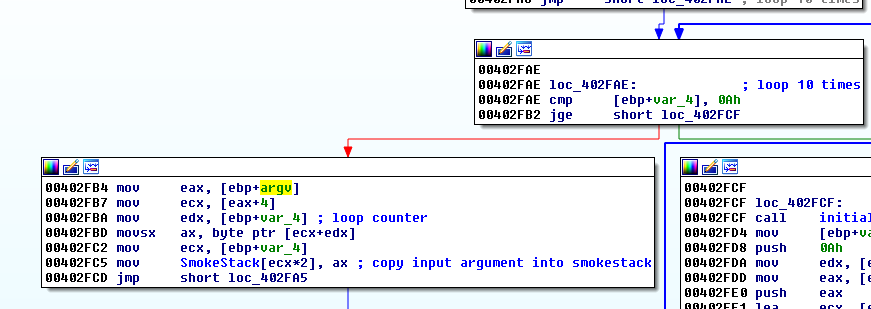
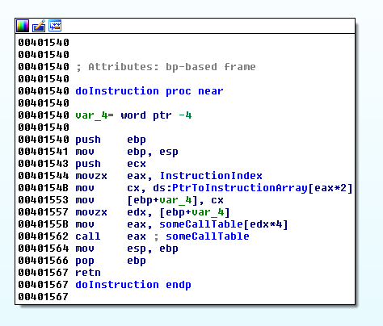
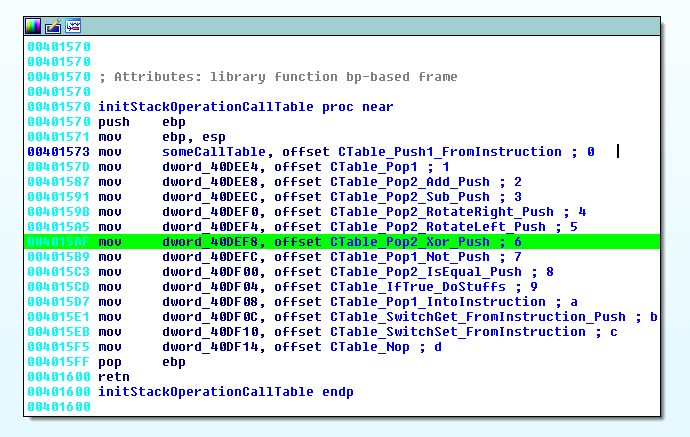
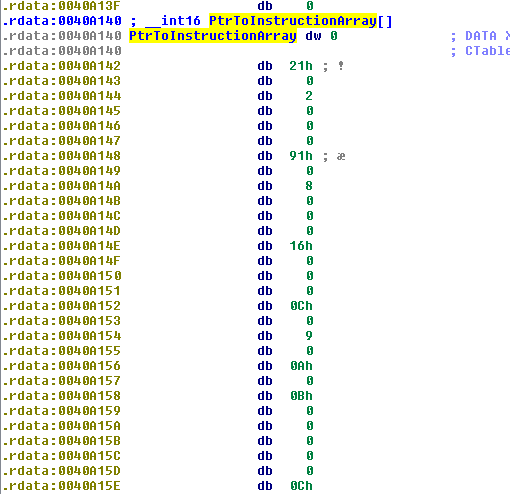

## Flare-On CTF 2016
# Challenge 05 : Smokestack

Throw the binary into IDA Pro. This time round, there isn't any interesting strings to start with. Instead, let's start with the main function. 

Right near the start of the main function, we see the following code


It calls "strlen" on the first argument and checks that it is at least 10 characters long



It then goes into a loop for 10 times where it copies 10 characters from the input argument into a stack data structure (which I call "smokestack" due to the challenge name)


This is the main meat of the binary. Some kind of initialization function is first called. After that, the return value from the initialization function is appended to the end of the input argument. 

This string is then pass to some kind of SHA1 function followed by what seems like RC4 decryption. On hindsight, this string is most likely a password passed to some kind of SHA1 key derivation function which then uses the key to decrypt the flag with RC4. Finally, something (most likely the flag) is printed to screen.

The SHA1 and RC4 functions are actually not that important. The most important function is the initializeValues function.

Let's take a look at that.


It first initializes some kind of call table (I'll get back to this later)

It then loops through a Instruction Array of size 0x182, calling the "doInstruction" function on each iteration.



The "doInstruction" function takes a byte off the instruction array and uses it as a index to call into the call table initialized before. This looks like custom opcode parsing.

Let's look at the call table



The functions here all operates on the smokestack created before.

Here is a summary of these functions
- [0] Push the next byte from the InstructionArray onto the Smokestack
- [1] Pop 1 byte off the Smokestack
- [2] Pop 2 bytes, Adds them, Push the result back
- [3] Pop 2 bytes, Subtracts them, Push the result back
- [4] Pop 2 bytes, RotateRight them, Push the result back
- [5] Pop 2 bytes, RotateLeft them, Push the result back
- [6] Pop 2 bytes, Xor them, Push the result back
- [7] Pop 1 byte, Not it, Push the result back
- [8] Pop 2 bytes, Compare them, Push 1 if equal, 0 if not equal 
- [9] Pop 3 bytes, If 3rd byte is 1, Push 1st byte back. Else, Push 2nd byte back
- [A] Pop 1 byte into the instruction index (this is basically a "jmp" instruction)
- [B] Push a "variable" onto the stack 
- [C] Pop 1 byte into a "variable"
- [D] Nop

For functions B and C, "Variable" refers to 1 of the following (ReturnValue, TmpValue, SmokeStackPointer or InstructionIndex)

The InstructionArray is defined as a constant array and can be dumped straight from IDA (Although, I used a debugger as it is easier to dump from there)



Below is the entire InstructionArray

```
0040A140  00 00 21 00 02 00 00 00 91 00 08 00 00 00 16 00  ..!.............
0040A150  00 00 0C 00 09 00 0A 00 0B 00 00 00 00 00 0C 00  ................
0040A160  02 00 0C 00 00 00 00 00 1D 00 0A 00 0B 00 00 00  ................
0040A170  00 00 63 00 02 00 0C 00 00 00 00 00 18 00 06 00  ..c.............
0040A180  00 00 54 00 08 00 00 00 33 00 00 00 29 00 09 00  ..T.....3...)...
0040A190  0A 00 0B 00 00 00 00 00 2C 00 02 00 0C 00 00 00  ........,.......
0040A1A0  00 00 3D 00 0A 00 00 00 0E 00 01 00 0B 00 00 00  ..=.............
0040A1B0  00 00 59 00 02 00 0C 00 00 00 0B 00 00 00 00 00  ..Y.............
0040A1C0  00 00 0C 00 01 00 00 00 09 00 0C 00 00 00 0B 00  ................
0040A1D0  01 00 00 00 02 00 02 00 0C 00 01 00 0B 00 00 00  ................
0040A1E0  00 00 01 00 03 00 0C 00 00 00 0B 00 00 00 00 00  ................
0040A1F0  00 00 08 00 00 00 47 00 00 00 60 00 09 00 0A 00  ......G...`.....
0040A200  0C 00 00 00 0B 00 01 00 03 00 00 00 5D 00 08 00  ............]...
0040A210  00 00 7C 00 00 00 6E 00 09 00 0A 00 0B 00 00 00  ..|...n.........
0040A220  00 00 07 00 03 00 0C 00 00 00 00 00 5B 00 0C 00  ............[...
0040A230  01 00 00 00 87 00 0A 00 00 00 36 00 0C 00 01 00  ..........6.....
0040A240  0B 00 00 00 0B 00 01 00 02 00 0C 00 01 00 0B 00  ................
0040A250  01 00 00 00 58 00 02 00 06 00 00 00 F9 00 08 00  ....X.......ù...
0040A260  00 00 A0 00 00 00 96 00 09 00 0A 00 0B 00 00 00  .. .............
0040A270  00 00 4D 00 06 00 0C 00 00 00 00 00 AE 00 0A 00  ..M.........®...
0040A280  00 00 23 03 00 00 2B 01 03 00 0C 00 01 00 0B 00  ..#...+.........
0040A290  00 00 0B 00 01 00 02 00 0C 00 01 00 0C 00 01 00  ................
0040A2A0  0B 00 01 00 0B 00 01 00 00 00 01 00 03 00 0C 00  ................
0040A2B0  01 00 00 00 03 00 02 00 0B 00 01 00 00 00 00 00  ................
0040A2C0  08 00 00 00 B2 00 00 00 C7 00 09 00 0A 00 07 00  ....²...Ç.......
0040A2D0  00 00 77 FE 08 00 00 00 D8 00 00 00 D1 00 09 00  ..wþ....Ø...Ñ...
0040A2E0  0A 00 0B 00 00 00 00 00 58 00 02 00 0C 00 00 00  ........X.......
0040A2F0  00 00 03 00 04 00 00 00 8C 00 02 00 00 00 94 60  ...............`
0040A300  08 00 00 00 EE 00 00 00 E7 00 09 00 0A 00 0B 00  ....î...ç.......
0040A310  00 00 00 00 E7 00 02 00 0C 00 00 00 0B 00 01 00  ....ç...........
0040A320  02 00 00 00 0C 00 06 00 00 00 74 00 08 00 00 00  ..........t.....
0040A330  07 01 00 00 FD 00 09 00 0A 00 0B 00 00 00 00 00  ....ý...........
0040A340  09 00 03 00 0C 00 00 00 00 00 1D 01 0A 00 00 00  ................
0040A350  0A 00 0C 00 01 00 0B 00 01 00 00 00 01 00 03 00  ................
0040A360  0C 00 01 00 0B 00 01 00 00 00 00 00 08 00 00 00  ................
0040A370  0B 01 00 00 1D 01 09 00 0A 00 00 00 06 00 05 00  ................
0040A380  00 00 C0 1D 08 00 00 00 33 01 00 00 29 01 09 00  ..À.....3...)...
0040A390  0A 00 0B 00 00 00 00 00 71 00 02 00 0C 00 00 00  ........q.......
0040A3A0  00 00 3D 01 0A 00 0B 00 00 00 00 00 77 00 02 00  ..=.........w...
0040A3B0  0C 00 00 00 00 00 3D 01 0A 00 00 00 16 00 02 00  ......=.........
0040A3C0  00 00 0E 00 03 00 00 00 61 00 08 00 00 00 53 01  ........a.....S.
0040A3D0  00 00 4C 01 09 00 0A 00 0B 00 00 00 00 00 2C 00  ..L...........,.
0040A3E0  03 00 0C 00 00 00 0C 00 01 00 0B 00 01 00 00 00  ................
0040A3F0  2C 21 0B 00 01 00 00 00 01 00 03 00 0C 00 01 00  ,!..............
0040A400  00 00 07 00 03 00 0B 00 01 00 00 00 00 00 08 00  ................
0040A410  00 00 59 01 00 00 6E 01 09 00 0A 00 00 00 CA 01  ..Y...n.......Ê.
0040A420  06 00 00 00 F5 1F 08 00 00 00 81 01 00 00 7A 01  ....õ.........z.
0040A430  09 00 0A 00 0B 00 00 00 00 00 12 00 02 00 0C 00  ................
0040A440  00 00 0D 00 0A 25 73 0A 00 00 00 00 30 E1 40 00  .....%s.....0á@.
```

I decoded the whole instruction array [by hand here](soln.txt). If it doesn't display the indentation properly, use either Notepad++ or Sublime to view it. 

I will not be describing what each byte does, it should all be pretty straight forward, reading from the solution text file.

In summary, these operations checks if your input argument is equal to a certain password. It is quite amazing that it can create if/else constructs and even loop constructs with just these 12 functions.

The flag is revealed when the correct password ("kYwxCbJoLp") is entered


The flag is **A_p0p_pu$H_&_a_Jmp@flare-on.com**

