## Flare-On CTF 2016
# Challenge 06 : Khaki

Throw the binary into IDA Pro. Looking at the Strings tab, there is lots of reference to Python and 1 interesting string that contains "py2exe".

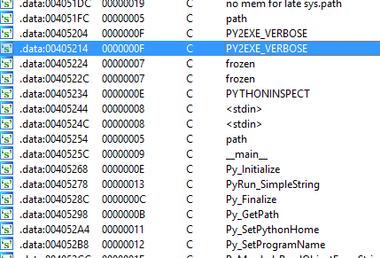

Some googling reveals that this may be an executable compiled using [py2exe](http://www.py2exe.org/)

Before we go further, you can try to execute the binary to see what it does


It asks you to guess a random number between 1 to 100. Another thing to note is that none of these strings that we see are shown in IDA Pro.

### Un-Pying

Googling about reversing py2exe executables reveals several tools that can perform "un-py2exe". I used [Py2Exe Binary Editor](https://sourceforge.net/projects/p2ebe/). Download the tool and run it on the challenge binary. Click the "All" button to dump all the files

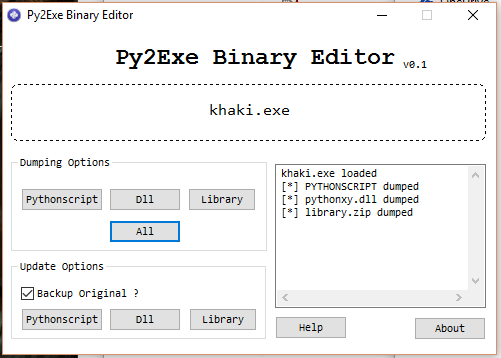

The python code that we are interested in is in the "PYTHONSCRIPT" file. I found the following [python code](extractpyc.py) that is able to extract the pyc files from "PYTHONSCRIPT"

```py
import marshal, imp

f=open('PYTHONSCRIPT','rb')
f.seek(17)  # Skip the header, Header size is 28 = 17+11 bytes for characters, l i b r a r y . z i p 

ob=marshal.load(f)

for i in range(0,len(ob)):
    open(str(i)+'.pyc','wb').write(imp.get_magic() + '\0'*4 + marshal.dumps(ob[i]))

f.close()
```

Running the script will dump out 3 pyc files (0.pyc, 1.pyc, 2.pyc)

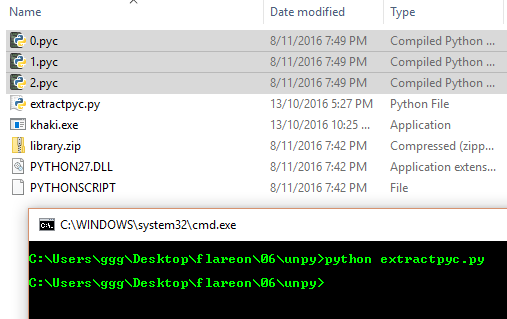

Next, I used [Easy Python Decompiler](https://sourceforge.net/projects/easypythondecompiler/) to decompile all 3 pyc files


0.pyc and 1.pyc decompiles successfully but they do not contain any interesting code

2.pyc however failed to decompile.

The next thing I tried was to use a disassembler instead. I found a [python script](disasm.py) that performs disassembly of pyc files. I would like to credit the original creator of this script but I cant remember where I found it from. If anybody recognizes this code, do let me know :)

Running the script against 2.pyc produces this [disassembly](2.dis). Several familiar strings can now be seen

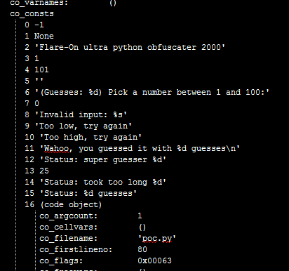

Looking at the python assembly code, it seems to be obfuscated by lots of "useless" code

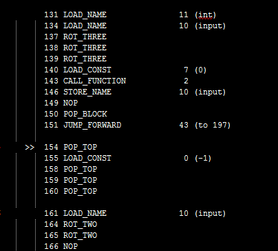

### Reversing Python Disassembly

This [site](http://unpyc.sourceforge.net/Opcodes.html) has a good summary of the different python opcodes. Looking through the code, I identified some patterns of code as "useless" (the result from these operations is equivalent to a "nop")
- LOAD CONSTANT 0, POP_TOP
- ROT 2, ROT 2
- ROT 3, ROT 3, ROT 3

Removing these code blocks produces a much more [readable disassembly](2edit.dis)

It is fairly straight forward to read and understand what the code does. I've added comments in the following screenshots to better illustrate what the code is doing.

First of all, it generates a random number between 1 to 100 and repeatedly asks the user to guess it.


If an invalid input is supplied (e.g. non numeric input), the input is saved into the "error_input" variable and printed to the screen

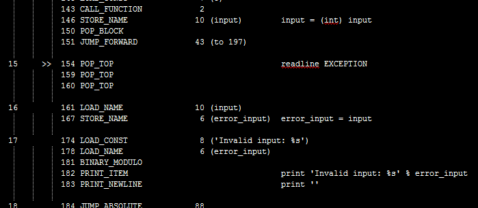

If the input number is equal to the target number, a string is stored into the "win_msg" variable and printed to the screen


If the user guessed the number with 1 try or with more than 25 tries, the program prints some message and exits. (This is not where we want to go)

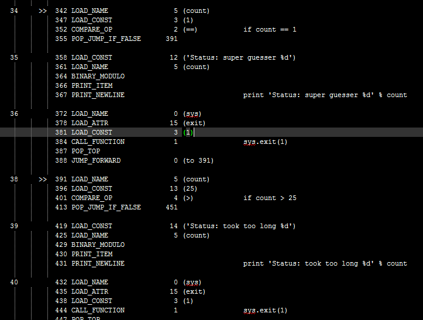

If the user took between 1 to 25 tries, the program grabs the "error_input" variable and perform a single byte (66) xor with it. The result hex result is compared to the string "312a232f272e27313162322e372548"

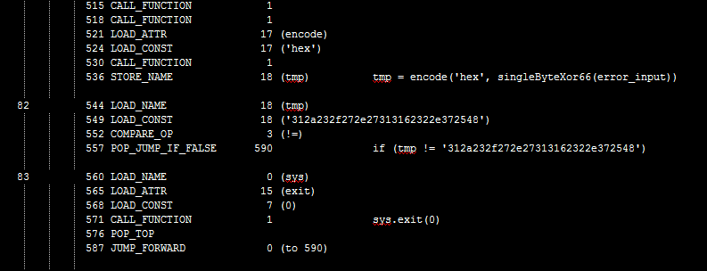

If the result matches, it then proceeds to the decryption routine. First, a byte array of constant values is created and stored in the variable "stuffs"

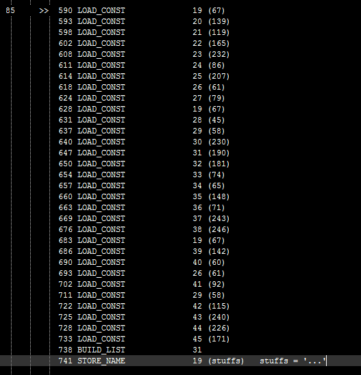

Next, a key is created in the following manner
- Concatenate the strings in "win_msg" and "tmp"
 - win_msg = 'Wahoo, you guessed it with %d guesses\n' % count
 - tmp = '312a232f272e27313162322e372548'
- Perform MD5 hashing on the concatenated string

The hexadecimal md5 hash value is stored in the variable "stuffer"


Finally, the "stuffs" byte array is decrypted using a standard xor decryption with the "stuffer" variable as the key.

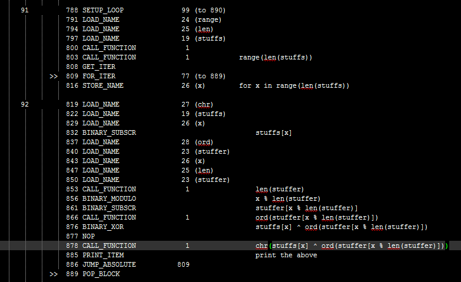

The only variable part of the key is the number of guesses that it took to guess the random number. In order to reach this part of the code, the number of guesses have to be between 1 and 25. Therefore, this is easily brute-forcable.

I wrote a [php script](soln.php) that will perform this brute force

Running the script will reveal the flag

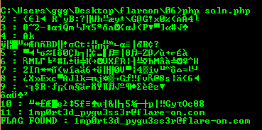

The flag is `1mp0rt3d_pygu3ss3r@flare-on.com`

