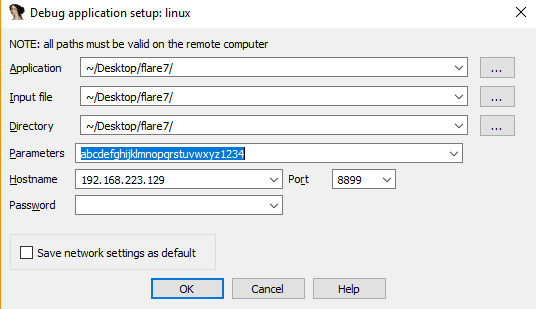
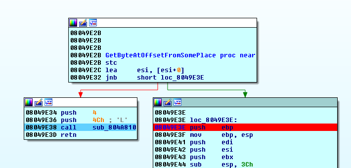
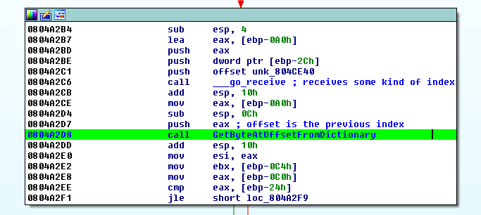
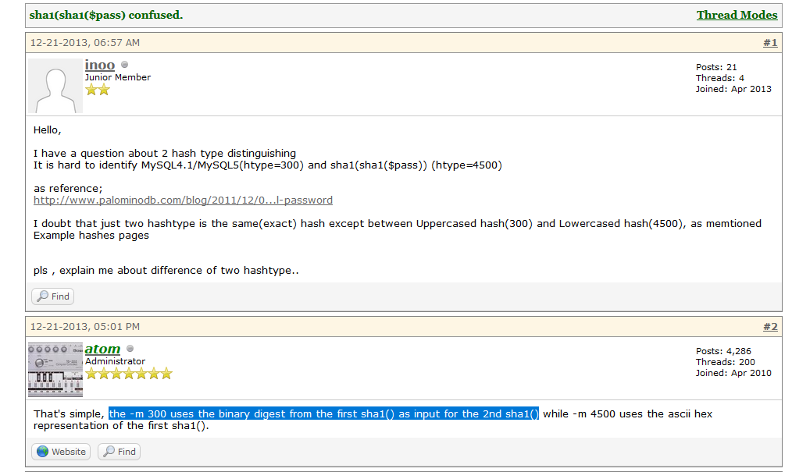
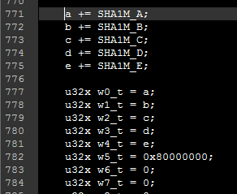
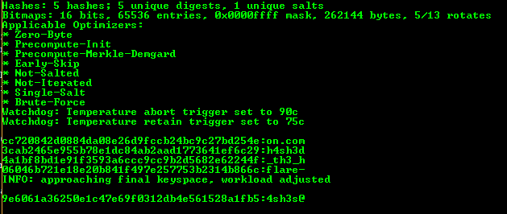

## Flare-On CTF 2016
# Challenge 07 : hashes

Open the binary in IDA Pro.

This time round, the binary is a ELF. Looking at the function names, there are multiple references to "go" and the main code starts in the "main_main" function. These are telltale signs that this is a "Go" binary.

Let's start by setting up the environment to run this binary. This binary requires 32-bit "libgo.so.7" library to run. I used Ubuntu and libgo7 is only available from Ubuntu 16.04 onwards. Therefore, I created a 64-bit Ubuntu 16.04 VM and installed libgo7

> sudo apt install libgo7:i386

Remember to include the ":i386" if you are running a 64-bit OS to install the 32 bit version of libgo7.

Running it with a dummy argument returns the message "Work on your Hash F00!"


Back in IDA, find the above string in the Strings window and do a x-ref. Back tracing from there will lead us to the "main_main" function. Let's try to setup a debugger to run through this code.

### Setting up for Remote IDA Debugging

I hate debugging with GDB on Linux. Here, I will show how to setup Linux debugging with IDA Pro.

Copy over the "linux_server" binary onto the Linux VM (It is located in the "dbgsrv" subfolder of the IDA installation).

On my system, I need to install the 32-bit version of libstdc++6 to run the "linux_server" binary

> sudo apt install libstdc++6:i386

Once installed, run the "linux_server" binary, specifying a port

> ./linux_server -p8899

Back in IDA, open the remote debugger options in Debugger->Process Options. Input the values as below. Remember to put some dummy arguments.



Start the debugger by clicking the "Play" button. Remember to select "Remote Linux Debugger"


IDA will complain about a missing input file and suggests copying 1 over. Click "Yes" and select the "hashes" executable file. It will be copied over to the target Linux VM and executed

Alright, remote linux debugging has been set up. You can now set breakpoints in IDA and debug the binary as any other normal binaries, but this time with a nice GUI :)

As the program is quite long, I will not go through the debugging step by step.

However, I would suggest putting a breakpoint at 0x0804a105 and start debugging from there. (The image below already gives a hint of what that function does)


Another thing to note is that my version of IDA does not disassemble GO properly. If you see a structure similar to the one below



The debugger will incorrectly return if you step through it normally. Instead, put a breakpoint at the start of the right branch and let it run to that breakpoint. Do take note of this as there are several similar structure throughout the code. You need to follow the right branch to get the correct code flow.

### Program Logic

Below is a summary of what the program is doing.

- Checks if input is valid. (If not valid, print failure message and exits)
 - Input is 0x1e (30) chars long
 - Input only contains characters from this dictionary "abcdefghijklmnopqrstuvwxyz@-._1234"
- Splits the input into 5 strings of 6 chars each
- Calls a hashing function on each of them
 - The hashing function is a TripleSha1 (Do SHA1 3 times consecutively on the raw bytes)
- Combines the 5 hashes to form a string that is 40*5 = 200 chars long
- Checks the hash against a Target Hash
 - If it is the same, the success message is displayed
 
The interesting part is how the target hash is derived. There is a certain "Dictionary" that is used to build this target hash. I've dumped it out in a [dictionary](dictionary) file.



The "GetByteAtOffsetFromDictionary" functions retrieves a byte from the dictionary at the specified offset index. Below is how the target hash is created

- Takes the first character of the hash and uses it as a index to get a byte from the dictionary
 - CurIndex = Hash[0] + 0x1cd, DictByte = Dict[CurIndex]
- Checks that Hash[0] is equals to DictByte
 - If not equal, show error message and exits
- The subsequent bytes of the target hash is formed by taking the byte at offset 0x1cd from the previous byte
 - NextByte = Dict[(CurIndex + 0x1cd & 0xfff)]

I wrote the following php code to find which starting hash value will be equal to its corresponding DictByte

```php
$dict = file_get_contents("dictionary");

$next = array();
for ($i=0; $i<256; $i++){
	$tmp = $dict[$i+0x1cd];
	
	$hex1 = dechex($i);
	$hex2 = bin2hex($tmp);
	
	if (strcmp($hex1, $hex2) === 0) {
		echo "SAME!!! ";
		echo "$hex1 : $hex2 \n";
		$next[] = $i;
	}
}
```

It gave the following results

```
SAME!!! 3c : 3c
SAME!!! 7a : 7a
SAME!!! f9 : f9
```
 
These 3 are the valid first bytes of the target hash. I then wrote the following php code to generate the target hash based on these first bytes

```php
function genTarget($startbyte, $dict){
	$target = "";
	
	$tmpindex = $startbyte;
	for ($i=0; $i<0x64; $i++){
		$tmpindex = ($tmpindex + 0x1cd) & 0xfff;
		$target .= $dict[$tmpindex];
	}
	
	return $target;
}
```

Running it gives the following 3 possible target hashes

```
3cab2465e955b78e1dc84ab2aad1773641ef6c294a1bf8bd1e91f3593a6ccc9cc9b2d5682e62244f9e6061a36250e1c47e69f0312db4e561528a1fb506046b721e18e20b841f497e257753b2314b866ccc720842d0884da08e26d9fccb24bc9c27bd254e

7afc01ff7c2ae6768ad7281b1025c7d64e9a905fef16ec2a43f5d840efdae1aaaabd7dc3b7670810a4f6f80389125aad77e918db77a466e5ab7db10ffe140ae073bca6e0071d7d1c29a5fa1b73a99a064714505cf92f2fbaeaac1059a5613a3928285b88

f91727f8892e34f2be1786fa115bc4ad621dd4ac92e4de8810744a70338e854adc7803e1eab7094138772f47a05e778af70a1f1d5c8674b6fa63f4127cb25b5598ea410086a995d0c41770b46414599bee613d1a1a64e064c31b9222f70566b9d6939c52
```

Based on previous experience, the flag of this challenge would most likely be the plaintext of this target hash. 

As Flareon 2016 flags are all in the format of *@flare-on.com. I assume that this flag will also follow this format. This means that the input would have been broken up as follows

```
XXXXXX
YYYYYY
ZZZZZ@
flare-
on.com
```

Performing the TripleSHA1 hash on "flare-" and "on.com"

```
flare- : 06046b721e18e20b841f497e257753b2314b866c
on.com : cc720842d0884da08e26d9fccb24bc9c27bd254e
```

This matches the ending of the first possible hash. Therefore, our target hash is the following

> 3cab2465e955b78e1dc84ab2aad1773641ef6c294a1bf8bd1e91f3593a6ccc9cc9b2d5682e62244f9e6061a36250e1c47e69f0312db4e561528a1fb506046b721e18e20b841f497e257753b2314b866ccc720842d0884da08e26d9fccb24bc9c27bd254e

Breaking it up into its component hashes

```
3cab2465e955b78e1dc84ab2aad1773641ef6c29
4a1bf8bd1e91f3593a6ccc9cc9b2d5682e62244f
9e6061a36250e1c47e69f0312db4e561528a1fb5
06046b721e18e20b841f497e257753b2314b866c (flare-)
cc720842d0884da08e26d9fccb24bc9c27bd254e (on.com)
```

This [php script](soln_part1.php) does all of the above.

We now have to brute-force the first 3 hashes. 

### Brute-Forcing

I also wrote a [php script](soln_part2.php) that will perform the brute-forcing. However, it was extremely slow. It took 21 hours to brute-force the 3 hashes. Instead, I'll document how to use Hashcat to do this as it is more interesting and much faster (completed in mere seconds)

However, Hashcat by default does not support TripleSHA1 with raw bytes. Older versions of Hashcat used to have Method 4600 which is "sha1(sha1(sha1(x)))". However, my testing shows that it used hex chars instead of raw bytes for the repeated SHAs. Trying to modify method 4600 proved to be difficult.

Some googling led me to this [article](https://hashcat.net/forum/thread-2933.html)



Method 300 performs sha1(sha1(x)) using raw bytes for the 2nd SHA1. It would be easier to modify Method 300's code to make it run SHA1 one more time.

The method codes are located in the OpenCL sub-folder of Hashcat.

Open up "m00300_a3.cl". ("a3" because I will be using brute-force which is attack method 3)

The start of the 2nd SHA1 call is at the following line



Copy from that line till the end of the method and paste it at the end of the method to make it perform SHA1 one additional time. 

Save the file and run Hashcat as follows. Remember to delete the any compiled method 300 codes from the "kernels" folder to force Hashcat to recompile method 300.

> hashcat64.exe -m 300 -a 3 -1 zactual.charset zactual.hash ?1?1?1?1?1?1

I also restricted the charsets to the valid chars that was found earlier. You can see all these files in the "hashcatfile" subfolder of this write up.

Running it gives the results in mere seconds



The results in order are

```
3cab2465e955b78e1dc84ab2aad1773641ef6c29:h4sh3d
4a1bf8bd1e91f3593a6ccc9cc9b2d5682e62244f:_th3_h
9e6061a36250e1c47e69f0312db4e561528a1fb5:4sh3s@
06046b721e18e20b841f497e257753b2314b866c:flare-
cc720842d0884da08e26d9fccb24bc9c27bd254e:on.com
```

The flag is `h4sh3d_th3_h4sh3s@flare-on.com`