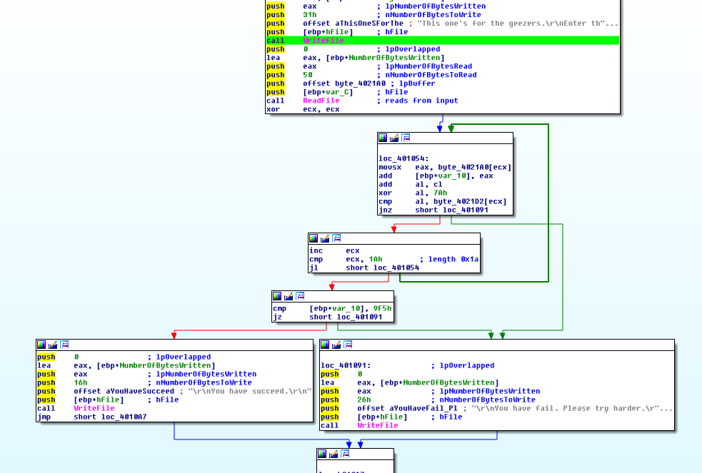
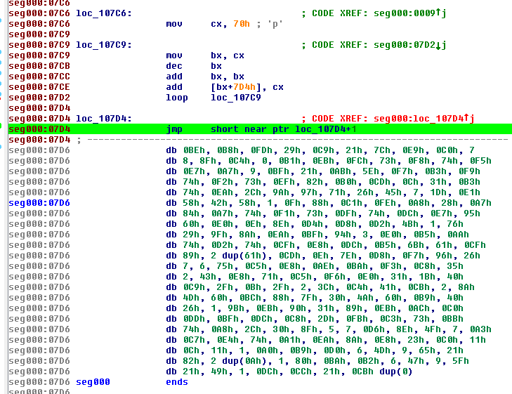
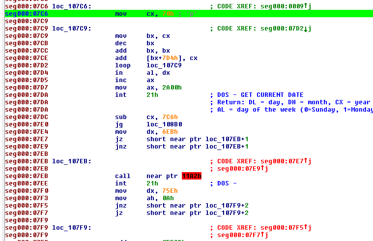
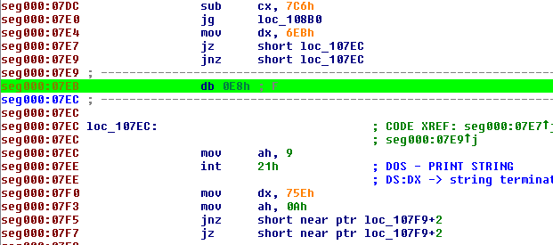
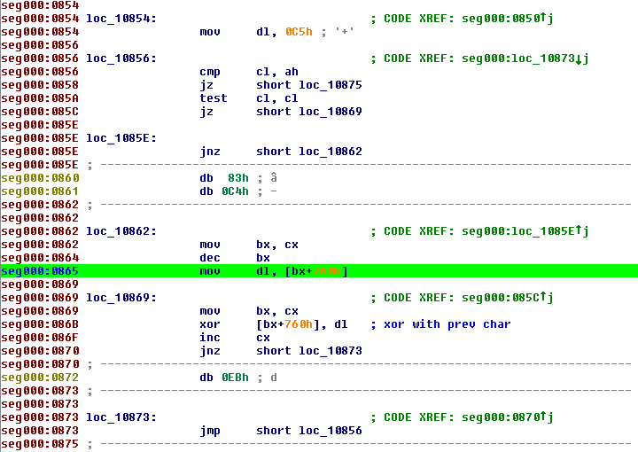

## Flare-On CTF 2016
# Challenge 08 : chimera

### Initial Analysis

Throw the binary into IDA Pro. The disassembly only contains 1 simple function.



The function does the following
- Get a input
- Perform single byte xor of 0x7a with the input
- Compare the xor result against the byte array at 'byte_4021D2'
- add the ascii value of the character into a 'sum' variable
- at the end of looping for 0x1a times, compare the sum with 0x9f5
- Based on the results, one of 2 messages are displayed

I wrote a [php script](soln1_wrongpw.php) to decrypt the xored buffer.

```php
echo decode("0E13110C5E14035D060B1551F90507070D4BF80EFDF2F7FCF007")."\n";

function decode($encstr){
	$enc = hex2bin($encstr);
	$sum = 0;
	$out = "";
	for ($i=0; $i<strlen($enc); $i++){
		$tmp = ord($enc[$i]) ^ 0x7a;
		$tmp = $tmp - $i;
		$sum += $tmp;
		$out .= chr($tmp);
	}
	
	return $out;
}
```

Running the script reveals the encrypted text as "this is the wrong password".

Obviously, this is the wrong flag (Yup, I tried entering it)

The code does nothing else, so where can the flag be hiding?

### Unpacking

I started looking around and I noticed this when I first open the binary in IDA Pro


Combined with the string "This is for the old geezers" that was displayed by the binary, perhaps this is the way.

Open the binary in IDA Pro as a MS-DOS executable


The code seems to make sense. Let's look at the code after the jump



This looks familiar. The code performs some kind of decoding loop and ends with a tail jump. This is an unpacking routine. The decoding loop and tail jump all perform operations on the binary blob right after the code

I reimplemented the decoding code into this [php script](soln2_unpacking.php)

```php
$data = file_get_contents('CHIMERA.wtf');

for ($i=0x70; $i>0; $i--){
	$tmp = $i - 1;
	$tmp = $tmp+$tmp;
	
	$index = $tmp + 0x814;
	addToData($index, $i);
}

function addToData($index, $addval){
	global $data;
	
	$cur = substr($data, $index, 2);
	$cur = strrev($cur); // change order due to endianess
	$tmpval =  (hexdec(bin2hex($cur)) + $addval) & 0xffff;
	$newhex = dechex($tmpval);
	while (strlen($newhex) < 4) $newhex = '0'.$newhex;
	//var_dump($newhex);
	$tmpval = hex2bin($newhex);
	$tmpval = strrev($tmpval); // reverse back for endianess
	
	$data[$index] = $tmpval[0];
	$data[$index+1] = $tmpval[1];
}

file_put_contents('unpacked.wtf', $data);
```

The script decodes the bytes and writes the output executable into a file

### Correcting IDA

Throw the unpacked binary into IDA Pro as a MS-DOS executable



The code kind of make sense now. Some parts are confusing because IDA is confused about certain execution bytes. We need to correct this.

Let's take one example below


The jump jumps to 0x107eb+1, but IDA Pro analyzes the execution bytes from 0x107eb instead.

Correct this using the following steps
- Click on the 0x107eb line
- Press 'u' to undefine current instruction
- Click on the correct jump address (0x107ec for this case)
- Press 'c' to tell IDA to analyze as code



Now the code makes more sense.

Repeat this procedure for all the jumps with addition offsets. The resulting code would make much more sense

### Getting the flag

Reversing the DOS code is pretty straight forward with 1 major difference.

Syscalls are performed using the "int 21" instruction. The value in ax is the syscall number to execute

This [site](http://stanislavs.org/helppc/int_21.html) has a listing of possible DOS syscalls.

The code first does a date check but that is not important.

It then gets user keyboard input using syscall 0xa


Syscall 0xa has certain things to take note of. Let's see its documentation


- The input buffer is passed using the dx register (0x75e in this case)
- The first byte of the input buffer is the max length to read (0x32 in this case (double click the address to see the pre-defined value))
- The second byte of the input buffer is the actual length of the input (will be written by the syscall)
- The third byte onward is the actual input

In summary, the **input length is at 0x75f** and actual **input string is at 0x760**. This info is important for understanding the rest of the code


The next part of the code loops through the input and performs some kind of dictionary xor encryption
- Create a index value using some kind of cyclic rotate left operation (rol)
- Get a xorkey byte from a dictionary using the index value as a index into the dictionary array (0x461)
- Peform a xor operation using the xorkey with the input byte

I reimplemented the logic into the following php code

```php
$dict = hex2bin('FF157420400089EC5DC34246C063862AAB08BF8C4C25193192B0AD14A2B667DD39D85F3F7B5CC2B2F62E759B6194CFCE6A9850F25BF045300E38EB3B6C667F243DDF8897B9B3F1CB83991A0DEFB103559E9A7A10E036E8D3E432C17807B76BC770C92CA091356DFE735EF4A4D9DB4369F58DEE447D48B5DC4B02A1E3D2A6213E2FA3D7BB845AFB8F121C4128C576599CF73306270A0BAF71164AE99F4F6FE20FBE2BE756D553792D641795A7BD7C1D5893A565F81813EABCE5F3370496A81E012982513C681F8EDA8A05227249FA87A95462C6AA09B4FDD6D1AC8511473A9DE64D1BCC528023FCED8B7E60CD6E57BADEAECAC4770C4ED4D0C8E1B8F926908134'); //from 0x461
$plain = "";

for ($i=strlen($enc2)-1; $i>=0; $i--){
	$cur = ord($enc2[$i]);
	if ($i == strlen($enc2)-1){
		// first run
		$index = rol(0x97,3);
	}
	else{
		$next = ord($enc2[$i+1]);
		$index = rol($next,3);
	}
	$tmp = ord($dict[$index]);
	$xorkey = ord($dict[$tmp]);
	$plain .= chr($cur ^ $xorkey);
}
```

The next part then performs a similar cyclic xor operation on the input array.



I've also re-implemented the logic into the following php code

```php
for ($i=0; $i<strlen($enc1); $i++){
	$cur = ord($enc1[$i]);
	if ($i == 0){
		$enc2 .= chr($cur ^ 0xc5);
	}
	else{
		$prev = ord($enc1[$i-1]);
		$enc2 .= chr($cur ^ $prev);
	}
}
```


The last part then checks if the results of the input array is equal to a pre-defined array at 0x7ac. Equality is checked by xor-ing the 2 values and checking that the result is 0.

To get the flag, we have to perform these operations in the reverse order
- Get the pre-defined array value from 0x7ac
- Perform the cyclic xor operation
- Perform the dictionary xor decryption

I wrote a [php script](soln3_decrypting.php) that does this.

Running it will reveal the flag


The flag is `retr0_hack1ng@flare-on.com`