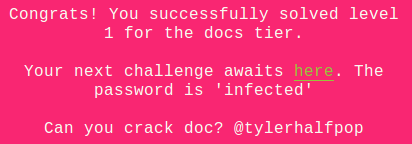
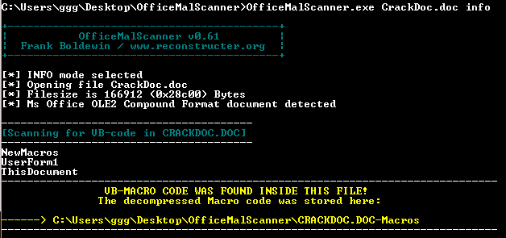

## LabyREnth CTF 2016
# Documents 2 : CrackDoc



The challenge file is another Office Word document.

I used OfficeMalScanner to extract the vb macro code from it



3 vb file was dumped. The one with the interesting code is ["UserForm1"](UserForm1)

```vba
Private Sub button_Click()
    x = suchcrypto(key.Text, "General Vidal")
    If x = "171,184,42,184,88,26,47,154,20,219,203,130,52,19,180,214,156,94,186,74,30,248,119,235,139,130,175,141,179,197,8,204,252," Then
        MsgBox "Wow. Good Job! Such crack."
    Else
        MsgBox "U can do. Try harder..."
    End If
End Sub

Function suchcrypto(sMessage, strKey)
    Dim kLen, x, y, i, j, temp
    Dim s(256), k(256)
    kLen = Len(strKey)
    For i = 0 To 255
        s(i) = i
        k(i) = Asc(Mid(strKey, (i Mod kLen) + 1, 1))
    Next
    j = 0
    For i = 0 To 255
        j = (j + k(i) + s(i)) Mod 256
        temp = s(i)
        s(i) = s(j)
        s(j) = temp
    Next
    x = 0
    y = 0
    For i = 1 To 3072
        x = (x + 1) Mod 256
        y = (y + s(x)) Mod 256
        temp = s(x)
        s(x) = s(y)
        s(y) = temp
    Next
    For i = 1 To Len(sMessage)
        x = (x + 1) Mod 256
        y = (y + s(x)) Mod 256
        temp = s(x)
        s(x) = s(y)
        s(y) = temp
 
        suchcrypto = suchcrypto & (s((s(x) + s(y)) Mod 256) Xor Asc(Mid(sMessage, i, 1))) & ","
    Next
End Function
```

It seems like a fairly straight-forward crypto function that we need to reverse. The crypto function performs some kind of sbox swapping operations. I reimplemented the whole crypto code in a [php script](soln.php).

```php
$encout = "171,184,42,184,88,26,47,154,20,219,203,130,52,19,180,214,156,94,186,74,30,248,119,235,139,130,175,141,179,197,8,204,252";
$key = "General Vidal";

$enc = "";
$parts = explode(",", $encout);
for ($i=0; $i<count($parts); $i++){
	$cur = intval($parts[$i]);
	$enc .= chr($cur);
}
$dec = crypto($enc, $key);
$dec = substr($dec,0,-1);
$plain = '';
$parts = explode(",", $dec);
for ($i=0; $i<count($parts); $i++){
	$cur = intval($parts[$i]);
	$plain .= chr($cur);
}
echo $plain."\n";

function crypto($msg, $key){
	$s = array();
	$k = array();
	$keylen = strlen($key);

	for ($i=0; $i<256; $i++){
		$s[$i] = $i;
		$k[$i] = ord(substr($key, ($i % $keylen), 1));
	}

	$j = 0;
	for ($i=0; $i<256; $i++){
		$j = ($j + $k[$i] + $s[$i]) % 256;
		$temp = $s[$i]; //swap
        $s[$i] = $s[$j]; 
        $s[$j] = $temp;
	}

	$x = 0;
	$y = 0;
	for ($i=1; $i<=3072; $i++){
		$x = ($x+1) % 256;
		$y = ($y + $s[$x]) % 256;
		$temp = $s[$x];
		$s[$x] = $s[$y];
		$s[$y] = $temp;
	}

	$ret = "";
	for ($i=0; $i<strlen($msg); $i++){
		$x = ($x+1) % 256;
		$y = ($y + $s[$x]) % 256;
		$temp = $s[$x];
		$s[$x] = $s[$y];
		$s[$y] = $temp;

		$ret .= ($s[($s[$x] + $s[$y]) % 256] ^ ord(substr($msg, $i, 1))) . ",";
	}
	return $ret;
}
```

Straight up running the script reveals the flag **PAN{L4$t_Night_@f@iry_Vizited_M3}**