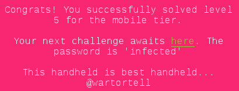
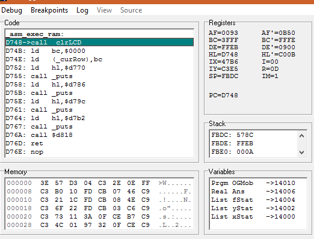
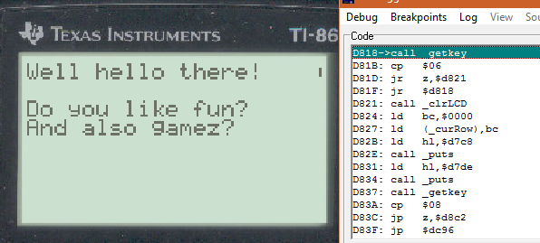
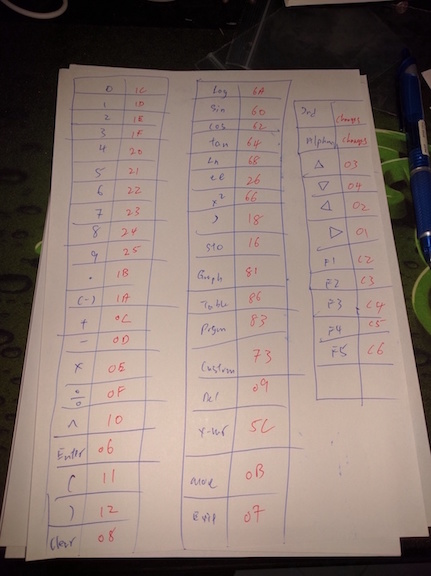

## LabyREnth CTF 2016
# Mobile 6 : OGMob (Ti-86)

Wow, this is a very interesting challenge. 

Running file on the provided binary shows the following 

This is a binary for the Ti-86 calculator. Solving the actual challenge is actually not very difficult. The most difficult part was finding an emulator to run the program on.

After much trying and testing, I believe Virtual-Ti is the best emulator for this. In addition, Virtual-Ti also comes with a built-in debugger which will make solving this challenge much easier.

Download the following files to setup the environment

- [Virtual-TI](http://www.ticalc.org/archives/files/fileinfo/84/8442.html)
- [Ti-86 Firmware ROMs](http://www.emuparadise.me/M.A.M.E._-_Multiple_Arcade_Machine_Emulator_ROMs/TI-86/180981-download)

Run the Virtual-Ti emulator and select one of the Ti-86 ROMs to load. Any one of them should do.

You should see something like this

To run the challenge binary, drag it (OGMob.86p) into the emulator

As this binary is written in assembly, type the following in the emulator to run it

> asm[OGMob]

It will show up as the following (The square brackets will become round)

You can try the program a few times to get a feel for it.

Now, let's use that debugger.
- Right Click and Reset the calculator
- Drag the binary file onto it again
- Right-Click the emulator and select "Set Program Entry Breakpoint"
- Select "OGMob" and click "OK"
- Type asm[OGMob] and press Enter

The debugger should kick in and attach itself to the process. You can now step about the code to figure out what the binary is doing.

**Program Logic**

Clears the screen and print some messages, then calls into 0xd818

Calls _getkey and loops until the return value is 0x06

The _getkey function basically puts the calculator into a waiting state until a key is pressed. The return value is the keycode of the key that was pressed. Make use of this never ending loop to map out all the keycodes of the calculator (return values are stored in the "A" register). Below is my hand-written map :)

Click "Enter" (keycode 0x06) and execution will jump to 0xd821 where it will print some more messages and calls _getkey again checking for return value of 0x08

The program continues this way checking for specific key presses. If all the correct keys are pressed, the flag will be printed on the screen

You can ignore the calls to 0xddf2 (just step over them), they are used to draw patterns onto the screen.

The correct keycode sequence is
- (0x06) Enter
- (0x08) Clear
- (0x11) '('
- (0x24) '8'
- (0x22) '6'
- (0x23) '7'
- (0x0d) '-'
- (0x21) '5'
- (0x1f) '3'
- (0x1c) '0'
- (0x25) '9'
- (0x12) ')'

The flag is **PAN{dis_C@1c's_Ju51_4_Y0UZ?!?}**

Cool! :D