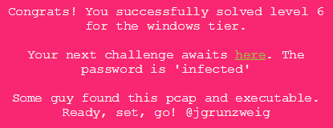
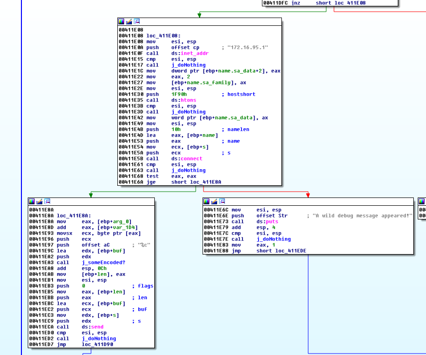
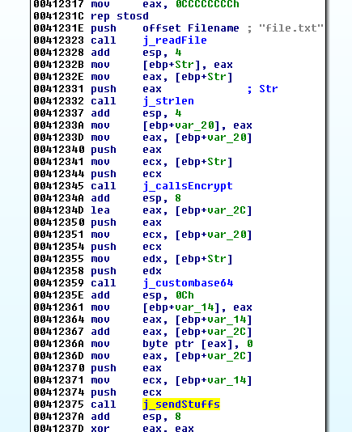
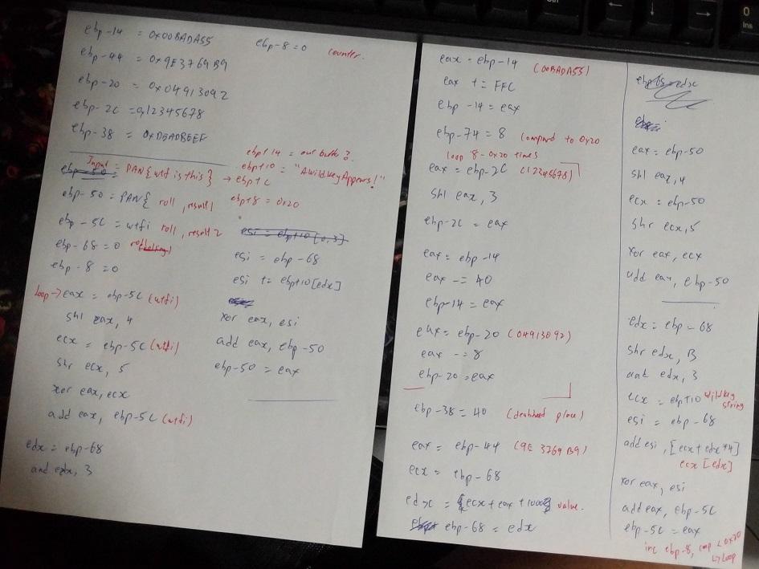

## LabyREnth CTF 2016
# Windows 7 : PCAP



Let's take a look at the [pcap](G0blinKing.pcap) file first.

### Extracting Data from PCAP file

"Follow TCP Stream" for the first 2 streams, one byte is sent in each of these streams.


Analyzing the packets that contain the 1 byte data, they all have the following similar properties
- Destination IP of 172.16.95.1
- Destination Port of 8080
- TCP Checksum of 0x16fc

Using scapy, I wrote the following [script](extractpcap.py) to extract the data from the pcap file based on the above properties

```py
from scapy.all import *
import pprint

pcap = 'G0blinKing.pcap'
pkts = rdpcap(pcap)

out = ''
counter = 0
for p in pkts:
	if p[IP].dst == "172.16.95.1" and p[TCP].dport == 8080 and p[TCP].chksum == 0x16fc:
		#pprint.pprint(p)
		counter += 1
		cur = p[Raw].load
		out = out + cur

print counter
print out
```

Running the script gives the following result


> B6XGLACYYUdwodupUtF0geaE5NKnf5gTiKxgwfWCJdi8Iq/b36ShdY/gs18m2VwpkTJPmg03FDpavvJF3EcAX8SUkrbpI1T61ZGKnrbD9gkf79eqi4giA4uKYEv9O/Iw3Godkhd0tB9e1ojQgW4307/OSTtWIzyEVhHbqkV694+fSZLD7FYMa80QYJQ5JRV/B6XGLACYYUdwodupUtF0geaE5NKnf5gT/Ycz/Ptt/q==

It looks like base64 encoded however, base64 decoding does not decode it to anything legible

Let's change our focus to the binary now

### Reversing the PuppetPal binary

Throw the binary into IDA Pro and look at the Strings


The IP of the destination server is shown. Follow the x-ref and it will lead to the part of the code that does the data sending



Also take not of the String "A wild debug message appeared". This String is shown when the binary is executed by itself


This suggests plain running the binary by itself will not work as it cannot connect to the server ip

Do a x-ref on this function to see where it is being called. I renamed this function to "sendStuffs". This will bring us to the following code



I've reversed several of the functions called here and renamed them to something that made more sense. Basically, the code here reads data from a file called "file.txt", passes it thorugh an encryption routine, then through a custom base64 encoding before sending it out to the server IP.

This means to retrieve the message sent in the PCAP file, the custom base64 routine and encryption routine needs to be reversed

I used a debugger (x32dbg/x64dbg) to step through the code to find out what these 2 routines are doing. I will not go through that step by step in this writeup as it is quite complex. Below is a summary of the algorithms used by these 2 routines

### Reversing the routines

First of, the custom base64 is relatively simple. It uses the same base64 algorithm but changes the character dictionary. I reversed and reimplmented it into a pair of php functions

```php
function customb64_decode($str){
	$dict = "qtgJYKa8y5L4flzMQ/BsGpSkHIjhVrm3NCAi9cbeXvuwDx+R6dO7ZPEno21T0UFW";
	if (strlen($str) % 4 !== 0) return false; // string length must by multiples of fours
	
	$ret = "";
	for ($i=0; $i<strlen($str); $i+=4){
		$cur = substr($str,$i,4);
		$b1 = substr($cur,0,1);
		$b2 = substr($cur,1,1);
		$b3 = substr($cur,2,1);
		$b4 = substr($cur,3,1);
		$b1pos = strpos($dict, $b1);
		$b2pos = strpos($dict, $b2);
		if (strcmp($b3,'=') === 0) $b3pos = -1; 
		else $b3pos = strpos($dict, $b3);
		if (strcmp($b4,'=') === 0) $b4pos = -1;
		else $b4pos = strpos($dict, $b4);
		if ($b1pos === false || $b2pos === false || $b3pos === false || $b4pos === false){
			echo "CANNOT FIND IN DICT!! $b1pos $b2pos $b3pos $b4pos\n";
			die();
		}
		$b1bits = get6bits($b1pos);
		$b2bits = get6bits($b2pos);
		$b3bits = get6bits($b3pos);
		$b4bits = get6bits($b4pos);
		$dword = $b1bits.$b2bits.$b3bits.$b4bits;

		$out1 = chr(bindec(substr($dword,0,8)));
		$out2 = chr(bindec(substr($dword,8,8)));
		$out3 = chr(bindec(substr($dword,16,8)));
		$ret .= $out1.$out2.$out3;
	}
	return $ret;
}

function customb64_encode($str){
	$dict = "qtgJYKa8y5L4flzMQ/BsGpSkHIjhVrm3NCAi9cbeXvuwDx+R6dO7ZPEno21T0UFW";
	
	$out = "";
	$parts = str_split($str,3);
	for ($i=0; $i<count($parts); $i++){
		$part = $parts[$i];
		$b1 = decbin(ord(substr($part,0,1)));
		$b2 = decbin(ord(substr($part,1,1)));
		$b3 = decbin(ord(substr($part,2,1)));
		while (strlen($b1) < 8) $b1 = '0'.$b1;
		while (strlen($b2) < 8) $b2 = '0'.$b2;
		while (strlen($b3) < 8) $b3 = '0'.$b3;
		$all = $b1.$b2.$b3;
		
		for ($k=0; $k<strlen($all); $k+=6){
			$cur = bindec(substr($all,$k,6));
			$out .= $dict[$cur];
		}
	}
	
	// If any of the last 2 chars are 'q' (0), replace with =
	$last = substr($out,-1);
	if (strcmp($last, $dict[0]) === 0) $out[strlen($out)-1] = '=';
	$last2nd = substr($out,-2,1);
	if (strcmp($last2nd, $dict[0]) === 0) $out[strlen($out)-2] = '=';
	
	return $out;
}
```

The encryption routine is much more complicated as illustrated by these notes (Yeap, I don't understand them now either...)



The routine performs operations on 8 byte blocks. Each 8 byte block is also split into 2 4 byte blocks. A series of arithmetic operations are performed on them. Any leftover bytes are not encrypted.

To write the decryption routine, I first reimplmented the encryption routine into php to understand what the encryption routine is doing. I confirmed the functions are correct by encrypting the same string with the php functions and the code in the binary (by using a file.txt file) and making sure the results are the same.

```php
function encrypt($msg){
	if (strlen($msg) < 8) return $msg;
	
	$i = 0;
	$enc = "";
	while ($i<strlen($msg)){
		$cur = substr($msg,$i,8);
		$enc .= encrypt8bytes($cur);
		$i += 8;
	}
	
	$i -= 8;
	if ($i < strlen($msg)-1){
		$enc .= substr($msg,$i);
	}
	return $enc;
}

function encrypt8bytes($msg){
	global $key;
	if (strlen($msg) !== 8) return false;
	
	$b1 = convStr2Int(substr($msg,0,4)); // ebp-50
	$b2 = convStr2Int(substr($msg,4,4)); // ebp-5c
	$keyindex = 0; // ebp-68
	$seed = 0x9e3769b9; // ebp-44
	$i = 0; //ebp-8
	//echo dechex($b1) . " " . dechex($b2) . "\n";
	while ($i<0x20){
		$eax = (($b2 << 4) & 0xffffffff) ^ (logicalRightShift($b2,5) & 0xffffffff);
		$eax = ($eax + $b2) & 0xffffffff;
		$esi = ($keyindex + $key[$keyindex & 3]) & 0xffffffff;
		$eax ^= $esi;
		$b1 = ($eax + $b1) & 0xffffffff;
		
		$keyindex = ($keyindex + $seed + 0x1000) & 0xffffffff; // keyindex is constant regardless of msg
		//echo "keyindex : ".dechex($keyindex)."\n";
		
		$eax = (($b1 << 4) & 0xffffffff) ^ (logicalRightShift($b1,5) & 0xffffffff);
		$eax = ($eax + $b1) & 0xffffffff;
		$esi = ($keyindex + $key[logicalRightShift($keyindex,0xb) & 3]) & 0xffffffff;
		$eax ^= $esi;
		$b2 = ($eax + $b2) & 0xffffffff;
		//echo dechex($b1) . " " . dechex($b2) . "\n";
		$i++;
	}
	
	// Reverse the bytes in each 4 bytes
	$out = "";
	
	$tmp = dechex($b1);
	$outtmp = "";
	while (strlen($tmp) < 8) $tmp = '0'.$tmp;
	for ($i=0; $i<strlen($tmp); $i+=2){
		$cur = substr($tmp,$i,2);
		$outtmp .= chr(hexdec($cur));
	}
	$out = strrev($outtmp);
	
	$tmp = dechex($b2);
	$outtmp = "";
	while (strlen($tmp) < 8) $tmp = '0'.$tmp;
	for ($i=0; $i<strlen($tmp); $i+=2){
		$cur = substr($tmp,$i,2);
		$outtmp .= chr(hexdec($cur));
	}
	$out .= strrev($outtmp);
	
	return $out;
}
```

After that, I wrote the decryption routine by performing the logical reverse of the encryption operations

```php
function decrypt($enc){
	if (strlen($enc) < 8) return $enc;
	
	$i = 0;
	$msg = "";
	while ($i<strlen($enc)){
		$cur = substr($enc,$i,8);
		$msg .= decrypt8bytes($cur);
		$i += 8;
	}
	
	$i -= 8;
	if ($i < strlen($enc)-1){
		$msg .= substr($enc,$i);
	}
	return $msg;
}

function decrypt8bytes($enc){
	global $key;
	if (strlen($enc) !== 8) return false;
	
	$keyindex = array();
	$keyindex[0] = hexdec("9e3779b9");
	$keyindex[1] = hexdec("3c6ef372");
	$keyindex[2] = hexdec("daa66d2b");
	$keyindex[3] = hexdec("78dde6e4");
	$keyindex[4] = hexdec("1715609d");
	$keyindex[5] = hexdec("b54cda56");
	$keyindex[6] = hexdec("5384540f");
	$keyindex[7] = hexdec("f1bbcdc8");
	$keyindex[8] = hexdec("8ff34781");
	$keyindex[9] = hexdec("2e2ac13a");
	$keyindex[10] = hexdec("cc623af3");
	$keyindex[11] = hexdec("6a99b4ac");
	$keyindex[12] = hexdec("8d12e65");
	$keyindex[13] = hexdec("a708a81e");
	$keyindex[14] = hexdec("454021d7");
	$keyindex[15] = hexdec("e3779b90");
	$keyindex[16] = hexdec("81af1549");
	$keyindex[17] = hexdec("1fe68f02");
	$keyindex[18] = hexdec("be1e08bb");
	$keyindex[19] = hexdec("5c558274");
	$keyindex[20] = hexdec("fa8cfc2d");
	$keyindex[21] = hexdec("98c475e6");
	$keyindex[22] = hexdec("36fbef9f");
	$keyindex[23] = hexdec("d5336958");
	$keyindex[24] = hexdec("736ae311");
	$keyindex[25] = hexdec("11a25cca");
	$keyindex[26] = hexdec("afd9d683");
	$keyindex[27] = hexdec("4e11503c");
	$keyindex[28] = hexdec("ec48c9f5");
	$keyindex[29] = hexdec("8a8043ae");
	$keyindex[30] = hexdec("28b7bd67");
	$keyindex[31] = hexdec("c6ef3720");
	
	$b1 = convStr2Int(substr($enc,0,4));
	$b2 = convStr2Int(substr($enc,4,4));

	$i = 0x1f;
	$kindex = $keyindex[$i];
	//echo dechex($b1) . " " . dechex($b2) . "\n";
	while ($i >= 0){
		$eax = (($b1 << 4) & 0xffffffff) ^ (logicalRightShift($b1,5) & 0xffffffff);
		$eax = ($eax + $b1) & 0xffffffff;
		$esi = ($kindex + $key[logicalRightShift($kindex,0xb) & 3]) & 0xffffffff;
		$eax ^= $esi;
		if ($b2 < $eax) { // trick to add 0x100000000 in 32bit systems
			$tmp = 0xffffffff - $eax;
			$b2 = ($b2 + $tmp + 1) & 0xffffffff;
			//$b2 += 0x100000000;
		}
		else $b2 = ($b2 - $eax) & 0xffffffff;
		
		if ($i > 0) $kindex = $keyindex[$i-1];
		else $kindex = 0;
		
		$eax = (($b2 << 4) & 0xffffffff) ^ (logicalRightShift($b2,5) & 0xffffffff);
		$eax = ($eax + $b2) & 0xffffffff;
		$esi = ($kindex + $key[$kindex & 3]) & 0xffffffff;
		$eax ^= $esi;
		if ($b1 < $eax) {
			$tmp = 0xffffffff - $eax;
			$b1 = ($b1 + $tmp + 1) & 0xffffffff;
			//$b1 += 0x100000000;
		}
		else $b1 = ($b1 - $eax) & 0xffffffff;
		//echo dechex($b1) . " " . dechex($b2) . "\n";
		
		$i--;
	}
	
	// Reverse the bytes in each 4 bytes
	$out = "";
	
	$tmp = dechex($b1);
	$outtmp = "";
	while (strlen($tmp) < 8) $tmp = '0'.$tmp;
	for ($i=0; $i<strlen($tmp); $i+=2){
		$cur = substr($tmp,$i,2);
		$outtmp .= chr(hexdec($cur));
	}
	$out = strrev($outtmp);
	
	$tmp = dechex($b2);
	$outtmp = "";
	while (strlen($tmp) < 8) $tmp = '0'.$tmp;
	for ($i=0; $i<strlen($tmp); $i+=2){
		$cur = substr($tmp,$i,2);
		$outtmp .= chr(hexdec($cur));
	}
	$out .= strrev($outtmp);
	
	return $out;
}
```

I combined all these functions into a [php script](soln.php)

Running the script will reveal the flag


The flag is **PAN{did_1_mention_th0se_pupp3ts_fr34ked_m3_out_recent1y?}**