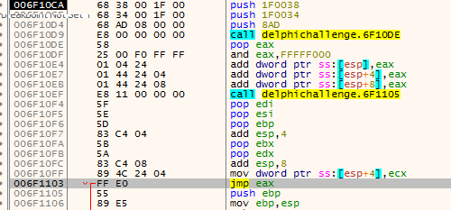
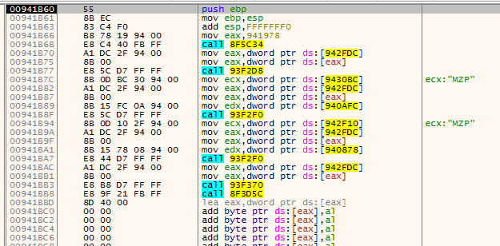
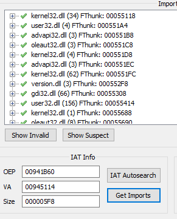
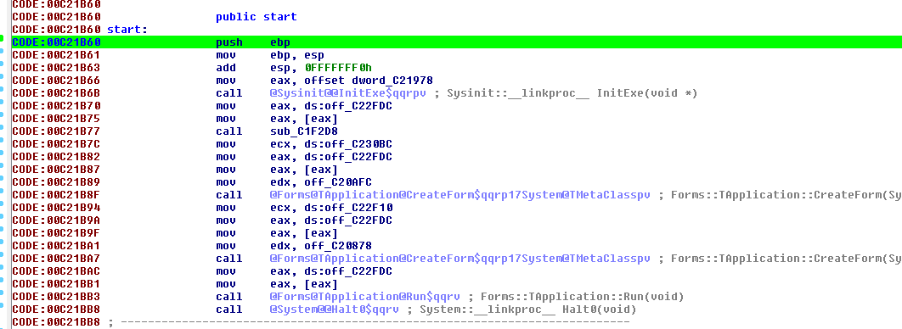
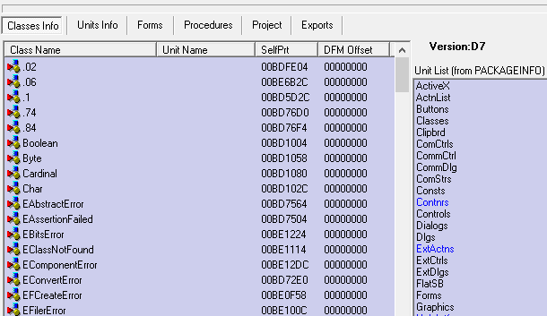
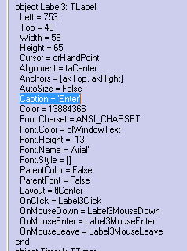
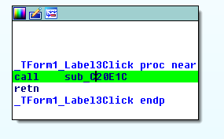
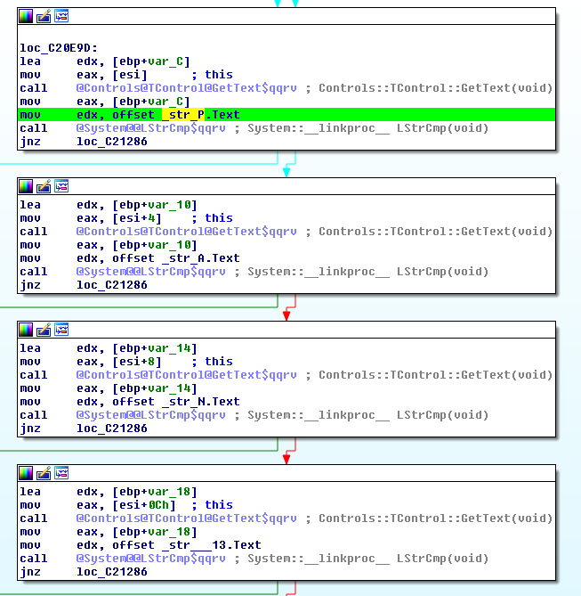
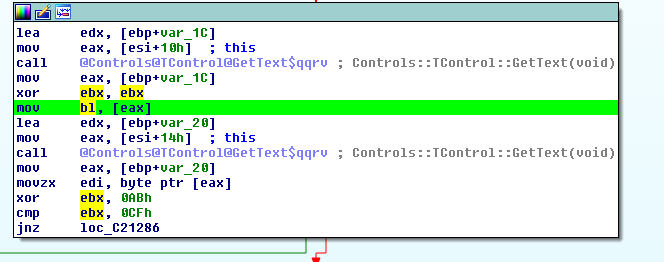

## LabyREnth CTF 2016
# Windows 9 : Delphi Challenge


Throw the binary into IDA Pro.

The analysis only shows 1 main function with a huge loop, minimal strings and minimal imported function. More importantly, the last instruction of the main function is a jump.

Thus, it is very highly this executable is packed.

### Unpacking the binary


Take note of the offset (0x17a0) of the tail jump instruction and set a breakpoint there. I used x32dbg from the x64dbg project as my debugger.


Let the program run till it hits the breakpoint, then take the jump.

From now on, you can try to dump the executable at each jump/call to test if the binary has completed unpacking. It is correct when IDA Pro spits out Delphi functions when you analyze the dumped binary.

For this writeup, I will go straight to the correct point to dump the executable.

After taking the jump, step into the first call instruction


Step over until the first jump is taken


Step over the 2 call instruction until you reach the 'jmp eax' instruction. Take the jump



The instructions should now look like this



Dump the executable at this point. Open up Scylla (Plugins -> Scylla). Click "IAT Autosearch" followed by "Get Imports". The imports box should fill up as follows



Click "Dump" and save the executable somewhere. After which, click "Fix Dump" and select the executable that you saved previously. A new executable with a "_SCY" prefix should be created in the same folder.

To make sure that the executable was dumped properly, run the executable in a safe environment and it should run without any errors. The following UI will be displayed


Throw the binary into IDA Pro and it should spit out Delphi functions



Close the debugger and focus on reversing the dumped executable.

### Finding the "flag" function

From the UI shown above, the interesting code should be the onClick handler of the "Enter" button.

As this is identified to be a Delphi program, we can use another tool ([DeDe](http://www.softpedia.com/get/Programming/Debuggers-Decompilers-Dissasemblers/DeDe.shtml)) to analyze it.

Run the program, select the dumped executable and click "Process". Once done, DeDe should be filled with lot's of information



Select the "Forms" tab and select "TForm1". Scroll down till you see the "Label3" object.



This is the "Enter" button that we are interested in because its "Caption" field is "Enter" which is what we saw on the UI. It's onClick handler is "Label3Click".

Click on the "Procedures" tab, select "TForm1" and double-click on the "Label3Click" function.


Take note of the function offset(0x1594) and find this function in IDA Pro



The called function is the flag function that we are looking for.

### Decoding the flag

Scroll down a little in the function and there is a bunch of 4 "GetText" and "StrCmp" function blobs. 



These blobs are comparing the 4 values returned from "GetText" against the characters "P", "A", "N" and "{" respectively. Thus this is where the flag is

The code then grabs the next 2 characters with "GetText" and checks them with the following arithmetic functions




The code continues to check each character using a different combination of arithmetic operations.

The solution is to reverse each of these arithmetic operations to get the flag.

I reversed the code and wrote a [php script](soln.php) to decode the flag. Take note that a few characters can have multiple possibilities because of "Shift-Right" operations which made the number lose precision. In those cases, I chose the character that made the most sense and fit into the phrase.

```php
$flag = array();
$flag[] = ord('P');
$flag[] = ord('A');
$flag[] = ord('N');
$flag[] = ord('{');

$flag[] = 0xcf ^ 0xab;
$flag[] = 0x1e ^ 0x2d;
$flag[] = 0x52 ^ 0x3e;
$flag[] = 0x22 ^ 0x52;
$flag[] = 0x08 ^ 0x60;
$flag[] = 0x68 + 1;
$flag[] = 0xe5 ^ 0xba;
$flag[] = 0xd7 ^ 0xbe;
$flag[] = 0xe6 / 2;
$flag[] = (0x2f << 1) + 1; 				// possibly 0x5e or 0x5f (choosing 0x5f thus the +1) '_'
$flag[] = 0x194 >> 2;
$flag[] = ((0x19 << 1) + 2); 			// possibly 0x34 or 0x35 (choosing 0x34) '4'
$flag[] = (0x1c0 ^ 0x0c) >> 2;
$flag[] = ((0x38 ^ 0x04) << 1) + 1; 	// possibly 0x78 or 0x79 (choosing 0x79 thus the +1) 'y'
$flag[] = ((0x28 + 7) << 1) + 1; 		// possibly 0x5e or 0x5f (choosing 0x5f thus the +1) '_'
$flag[] = ((0x8c / 0x0a) << 3) + 4;		// possibly from 0x70 to 0x78 (choosing 0x74 thus the +4) 't'
$flag[] = 0x60 / 2;
$flag[] = 0x17c >> 2;
$flag[] = ((0x59 ^ 0x60) << 1);			// possibly 0x72 or 0x73 (choosing 0x72) 'r'
$flag[] = (0x42 ^ 0x88) / 2;
$flag[] = (0xc0 ^ 0x2c) / 2;
$flag[] = ((0x16 << 1) + 7);			// possibly 0x33 or 0x34 (choosing 0x33) '3'
$flag[] = (0x36 ^ 0x29a) / 6;
$flag[] = ((0x130f0 >> 3) ^ 0x2486) >> 3;
$flag[] = ((0x2950 ^ 0x25a0) >> 4) / 3;
$flag[] = 0x7d;

$out = "";
for ($i=0; $i<count($flag); $i++){
	$out .= chr($flag[$i]);
}
echo $out."\n";
```

Run the script and the flag will be revealed


The flag is **PAN{d3lphi_is_e4sy_t0_rev3rSE}**

