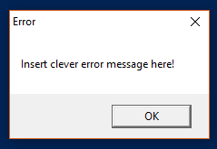
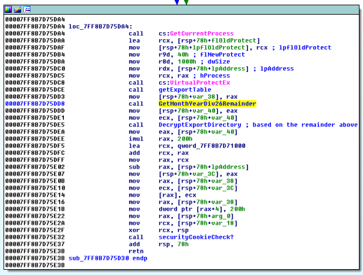
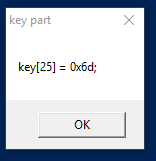

## Flare-On CTF 2017
# Challenge 06 : payload

We are provided with a 64-bit DLL

As this is a DLL, we start looking at its Export functions.  
There seems to be only 1 exported function called "EntryPoint" (take note of its ordinal number)


It seems to be just displaying a string in a MessageBox.

Let's create a simple python script to call this function

```py
from ctypes import *
chaldll = cdll.LoadLibrary("payload.dll")
chaldll[1]()
```

Running this python script gives us something weird.



The message is not what we expected from the exported function.  
Let's try to find this string in IDA Pro


This string is used in another function at offset 0x00007FF8B7D75A50

To understand what happened, we need to start debugging from the function "DLLEntryPoint" which is called when the DLL is initially loaded.


Edit the [python script](debugdll.py) to allow us to attach a debugger.

```py
from ctypes import *
import time

time.sleep(10) # Attach debugger before the dll is loaded
chaldll = cdll.LoadLibrary("payload.dll")
chaldll[1]()
```

Run the python script then attach a debugger. The sleep call gives us time to attach the debugger.

Put breakpoints at the following locations

```
Offset 6200 (DLLEntryPoint function)
00007FFACB146200 | 48 89 5C 24 08           | mov qword ptr ss:[rsp+8],rbx            |
00007FFACB146205 | 48 89 74 24 10           | mov qword ptr ss:[rsp+10],rsi           |
```

This breakpoint should hit when the payload.dll is loaded

```
Offset 5DD8
00007FFACB145DD8 | E8 33 E9 FF FF           | call payload.7FFACB144710               |
00007FFACB145DDD | 89 44 24 38              | mov dword ptr ss:[rsp+38],eax           |
```



The function will return the result of ((Month + Year) % 26)  
This result will select which encrypted instruction bytes to be loaded  
Change the return value (rax) at offset 5DDD to influence which encrypted bytes are to be loaded

```
Offset 5A50
00007FFACB145A50 | 44 89 4C 24 20           | mov dword ptr ss:[rsp+20],r9d           |
00007FFACB145A55 | 4C 89 44 24 18           | mov qword ptr ss:[rsp+18],r8            |
```

This is the EntryPoint function when Ordinal 1 is called after loading the dll  
It will decrypt the encrypted instruction bytes loaded before using RC4

```
Offset 5A86
00007FFACB145A86 | 48 8B C1                 | mov rax,rcx                             |
00007FFACB145A89 | 48 89 44 24 48           | mov qword ptr ss:[rsp+48],rax           |
```

The password for the RC4 decryption is in the memory region pointed by rax or rcx.  
Inspect that region

```
00007FFB04F84200  00 00 00 00 19 33 22 11 00 00 00 00 32 42 00 00  .....3".....2B..  
00007FFB04F84210  01 00 00 00 01 00 00 00 01 00 00 00 28 42 00 00  ............(B..  
00007FFB04F84220  2C 42 00 00 30 42 00 00 50 5A 00 00 40 42 00 00  ,B..0B..PZ..@B..  
00007FFB04F84230  00 00 6C 75 73 74 72 61 74 65 64 2E 64 6C 6C 00  ..lustrated.dll.  
00007FFB04F84240  6F 72 70 68 61 6E 65 64 69 72 72 65 70 72 6F 64  orphanedirreprod  
00007FFB04F84250  75 63 69 62 6C 65 63 6F 6E 66 69 64 65 6E 63 65  ucibleconfidence  
00007FFB04F84260  73 00 00 00 00 00 00 00 00 00 00 00 00 00 00 00  s...............  
```

The password is the string near the end.  
"orphanedirreproducibleconfidences" in this case. Take note of it

```
Offset 5B08
00007FFACB145B08 | 3A 14 08                 | cmp dl,byte ptr ds:[rax+rcx]            |
00007FFACB145B0B | 75 0B                    | jne payload.7FFACB145B18                |
```

OR

```
Offset 5AFA (Better Choice)
00007FFAD2125AFA | 48 8B 8C 24 A0 01 00 00  | mov rcx,qword ptr ss:[rsp+1A0]          |
00007FFAD2125B02 | 48 2B C8                 | sub rcx,rax                             |
```

This is where our input is checked against the password string.  
Follow the dump at [rcx+rax] or [rsp+1A0] and change (Ctrl+E) the bytes there to be the same as the password string

Let the program continue and a messagebox should popup with a part of the flag



Repeat this 0x1A times, changeing the remainder result from the Year+Month division from 0x00 to 0x1A

This is the full list of the passwords and results.  
Combining the key parts gives us the flag.

```
0x00:	pharmacology.dll 	filingmeteorsgeminately					key[00] = 0x77 'w'
0x01:	hernias.dll			leggykickedflutters						key[01] = 0x75 'u'
0x02:	pelf.dll			incalculabilitycombustionsolvency		key[02] = 0x75 'u'
0x03:	costal.dll			crappingrewardsanctity					key[03] = 0x75 'u'
0x04:	octopus.dll			evolvablepollutantgavial				key[04] = 0x74 't'
0x05:	challengers.dll		ammoniatesignifiesshampoo				key[05] = 0x2d '-'
0x06:	jeweller.dll		majesticallyunmarredcoagulate			key[06] = 0x65 'e'
0x07:	bronzing.dll		roommatedecapitateavoider				key[07] = 0x78 'x'
0x08:	low.dll				fiendishlylicentiouslycolouristic		key[08] = 0x70 'p'
0x09:	holidays.dll		sororityfoxyboatbill					key[09] = 0x30 '0'
0x0a:	rawhide.dll			dissimilitudeaggregativewracks			key[10] = 0x72 'r'
0x0b:	backstretch.dll		allophoneobservesbashfulness			key[11] = 0x74 't'
0x0c:	testability.dll		incuriousfatherlinessmisanthropically	key[12] = 0x73 's'
0x0d:	crossroad.dll		screensassonantprofessionalisms			key[13] = 0x40 '@'
0x0e:	cocking.dll			religionistmightplaythings				key[14] = 0x66 'f'
0x0f:	osseous.dll			airglowexactlyviscount					key[15] = 0x6c 'l'
0x10:	magnetising.dll		thonggeotropicermines					key[16] = 0x61 'a'
0x11:	allusively.dll		gladdingcocottekilotons					key[17] = 0x72 'r'
0x12:	gastronomist.dll	diagrammaticallyhotfootsid				key[18] = 0x65 'e'
0x13:	meetinghouse.dll	corkerlettermenheraldically				key[19] = 0x2d '-'
0x14:	flouted.dll			ulnacontemptuouscaps					key[20] = 0x6f 'o'
0x15:	malformation.dll	impureinternationalisedlaureates		key[21] = 0x6e 'n'
0x16:	pugnacious.dll		anarchisticbuttonedexhibitionistic		key[22] = 0x2e '.'
0x17:	ringbone.dll		tantalitemimicryslatted					key[23] = 0x63 'c'
0x18:	heresy.dll 			basophileslapsscrapping					key[24] = 0x6f 'o'
0x19:	lustrated.dll		orphanedirreproducibleconfidences		key[25] = 0x6d 'm'
```

The flag is **wuuut-exp0rts@flare-on.com**