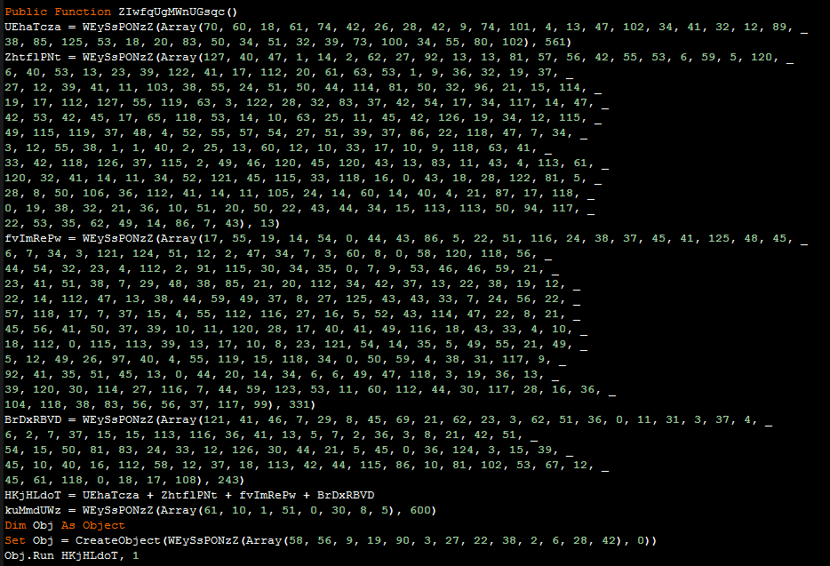
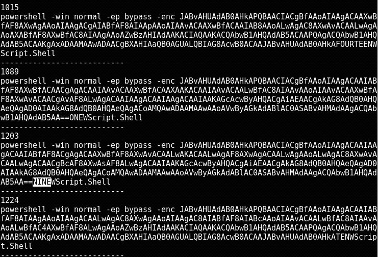

## LabyREnth CTF 2017
# Document 2 : FindWaldo

We are provided with a 7zip file containing 1337 doc files.

Due to the large size of the challenge file (>200MB), I did not upload it here.

Here is a [link](http://dl.labyrenth.com/waldo/04e9c649f2c81cdd1debb016ae4e3c6b06ad403fd1fc4e0cca30b8495da79318.7z) to the challenge file hosted on Labyrenth's Archive site. (PW is infected)

Using OfficeMalScanner on one of the doc file reveals that it uses similar macro code as the Document 1 challenge


It is the same decryption function where it uses an ActiveDocument variable as a dictionary to perform XOR decryption.  
However, the name of the ActiveDocument variable is different for each doc file.



It then uses the decryption function to decrypt several strings and runs them.

This challenge seems to be the same as Doc 1 challenge but on a much larger scale.  
We would need to write some automation scripts to make this easier.

I wrote [1_ExtractMacrosAndVars.php](1_ExtractMacrosAndVars.php) that will do the following
- Runs OfficeMalScanner on each document file
- Opens the macro script file and finds the ActiveDocument Variable name
- Runs [DocumentVariableExtractor.vbs](DocumentVariableExtractor.vbs) script on each document file to extract its corresponding ActiveDocument variable into a ".dict" file

```php
// Run this in the same directory with all the ".doc" files
$dir = ".\\";
$files = scandir($dir);
foreach ($files as $file){
    $parts = explode('.',$file);
    if (strcmp($parts[count($parts)-1], 'doc') !== 0) continue;
    
    // Extract the Macros from the doc files
    $fn = $dir.$file;
    $cmd = "OfficeMalScanner $fn info";
    passthru($cmd);
    
    // Extract the ActiveDocument Variable name from the "ThisDocument" macro file
    $VARNAME = "";
    $macroDir = strtoupper($file)."-MACROS\\";
    $data = file_get_contents($macroDir."ThisDocument");
    $marker = "Variables(\"";
    $start = strpos($data, $marker) + strlen($marker);
    $VARNAME = substr($data,$start,6);
    
    // Run DocumentVariableExtractor.vbs to extract the ActiveDocument variable
    $outfile = "$fn".".dict";
    $cmd = "cscript ../DocumentVariableExtractor.vbs ".realpath($fn)." $VARNAME > $outfile";
    passthru($cmd);
}
```

I wrote [2_DecodeAll.php](2_DecodeAll.php) that would use this dictionary files to decrypt the Strings in each of these document files and concats the result.

```php
$dir = "pkg".DIRECTORY_SEPARATOR;
$files = scandir($dir);
$count = 1;
foreach ($files as $file){
    $parts = explode('.',$file);
    if (strcmp($parts[count($parts)-1], 'doc') !== 0) continue;
    
    $fn = $dir.$file;
    $macroDir = $dir.strtoupper($file)."-Macros".DIRECTORY_SEPARATOR;
    
    // Extract the Arrays from the macro codes
    $macroFiles = scandir($macroDir);
    foreach ($macroFiles as $mfile){
        if (strcmp($mfile, "ThisDocument") === 0) continue;
        else if (strcmp($mfile, ".") === 0) continue;
        else if (strcmp($mfile, "..") === 0) continue;
        else{
            $mfn = $macroDir.$mfile;
            $code = file_get_contents($mfn);
            $res = grabDecryptCode($code);
            
            $tmp = file_get_contents($fn.".dict");
            $dicts = explode("\r\n",$tmp);
            $dict = $dicts[3];
            
            $out = "";
            for ($j=0; $j<count($res); $j++){
                $curres = $res[$j];
                $out .= decrypt($curres[0], $curres[1], $dict);
            }

            echo $out."\n";
        }
    }
    $count++;
}

function grabDecryptCode($code){
    $result = array();
    $marker = "(Array(";
    $parts = explode($marker, $code);
    for ($i=1; $i<count($parts); $i++){
        $cur = $parts[$i];
        $tmp = explode(")",$cur);
        
        // Get Numbers
        $curarray = array();
        $numstr = $tmp[0];
        $numstr = str_replace("_\r\n","",$numstr);
        $nums = explode(", ",$numstr);
        for ($j=0; $j<count($nums); $j++){
            $curarray[] = (int) $nums[$j];
        }
        
        // Get Offset
        $offset = (int) trim(substr($tmp[1],1));
        $result[] = array($curarray, $offset);
    }
    return $result;
}

function decrypt($crypted, $offset, $dict){
    $msg = "";
    for ($i=0; $i<count($crypted); $i++){
        $tmp = $crypted[$i] ^ ord($dict[$i+$offset]);
        $msg .= chr($tmp);
    }
    return $msg;
}
```

Most of the document files will run the same powershell command


> powershell -win normal -ep bypass -enc JABvAHUAdAB0AHkAPQBAACIACgA8ACAATgBvAHQAaABpAG4AZwAgAEgAZQByAGUAIABGAHIAaQBlAG4AZAAgAD4ACgAgACAAIAAgACAAIAAgACAAXAAgACAAIABeAF8AXwBeAAoAIAAgACAAIAAgACAAIAAgACAAXAAgACAAKABvAG8AKQBcAF8AXwBfAF8AXwBfAF8ACgAgACAAIAAgACAAIAAgACAAIAAgACAAIAAoAF8AXwApAFwAIAAgACAAIAAgACAAIAApAFwALwBcAAoAIAAgACAAIAAgACAAIAAgACAAIAAgACAAIAAgACAAIAB8AHwALQAtAC0ALQB3ACAAfAAKACAAIAAgACAAIAAgACAAIAAgACAAIAAgACAAIAAgACAAfAB8ACAAIAAgACAAIAB8AHwACgBnAHMAcgB0AAoAIgBAAAoAJABvAHUAdAB0AHkAIAA9ACAAJABvAHUAdAB0AHkAIAAqADEAMAAwADAAMAAKAFcAcgBpAHQAZQAtAEgAbwBzAHQAIAAkAG8AdQB0AHQAeQA=POSITIONWScript.Shell

However, some of them are different.  
I modified the code to only display those strings that are not the same as the above string

```php
$expected = "powershell -win normal -ep bypass -enc JABvAHUAdAB0AHkAPQBAACIACgA8ACAATgBvAHQAaABpAG4AZwAgAEgAZQByAGUAIABGAHIAaQBlAG4AZAAgAD4ACgAgACAAIAAgACAAIAAgACAAXAAgACAAIABeAF8AXwBeAAoAIAAgACAAIAAgACAAIAAgACAAXAAgACAAKABvAG8AKQBcAF8AXwBfAF8AXwBfAF8ACgAgACAAIAAgACAAIAAgACAAIAAgACAAIAAoAF8AXwApAFwAIAAgACAAIAAgACAAIAApAFwALwBcAAoAIAAgACAAIAAgACAAIAAgACAAIAAgACAAIAAgACAAIAB8AHwALQAtAC0ALQB3ACAAfAAKACAAIAAgACAAIAAgACAAIAAgACAAIAAgACAAIAAgACAAfAB8ACAAIAAgACAAIAB8AHwACgBnAHMAcgB0AAoAIgBAAAoAJABvAHUAdAB0AHkAIAA9ACAAJABvAHUAdAB0AHkAIAAqADEAMAAwADAAMAAKAFcAcgBpAHQAZQAtAEgAbwBzAHQAIAAkAG8AdQB0AHQAeQA=POSITIONWScript.Shell";

$dir = "pkg".DIRECTORY_SEPARATOR;
$files = scandir($dir);
$count = 1;
foreach ($files as $file){
    $parts = explode('.',$file);
    if (strcmp($parts[count($parts)-1], 'doc') !== 0) continue;
    
    $fn = $dir.$file;
    $macroDir = $dir.strtoupper($file)."-Macros".DIRECTORY_SEPARATOR;
    
    // Extract the Arrays from the macro codes
    $macroFiles = scandir($macroDir);
    foreach ($macroFiles as $mfile){
        if (strcmp($mfile, "ThisDocument") === 0) continue;
        else if (strcmp($mfile, ".") === 0) continue;
        else if (strcmp($mfile, "..") === 0) continue;
        else{
            $mfn = $macroDir.$mfile;
            $code = file_get_contents($mfn);
            $res = grabDecryptCode($code);
            
            $tmp = file_get_contents($fn.".dict");
            $dicts = explode("\r\n",$tmp);
            $dict = $dicts[3];
            
            $out = "";
            for ($j=0; $j<count($res); $j++){
                $curres = $res[$j];
                $out .= decrypt($curres[0], $curres[1], $dict);
            }
            //echo $out."\n\n";
            if (strcmp($out,$expected) !== 0){
                echo "---------------------------\n$count\n";
                echo $out."\n";
            }
        }
    }
    $count++;
}
```



I noticed that there is a "number" in text form just before the "WScript.Shell" string.  
Perhaps if we executed these powershell commands in the correct order, we will get the flag.

I wrote [3_DecodeFlag.php](3_DecodeFlag.php) that will do the following
- Only extract those powershell commands that is different from the "expected" command.
- Arrange them in the correct order in respect to the "number"
- Base64-decodes the command and display them in order

```php
// Run this outside the folder with all the "doc" files
$expected = "powershell -win normal -ep bypass -enc JABvAHUAdAB0AHkAPQBAACIACgA8ACAATgBvAHQAaABpAG4AZwAgAEgAZQByAGUAIABGAHIAaQBlAG4AZAAgAD4ACgAgACAAIAAgACAAIAAgACAAXAAgACAAIABeAF8AXwBeAAoAIAAgACAAIAAgACAAIAAgACAAXAAgACAAKABvAG8AKQBcAF8AXwBfAF8AXwBfAF8ACgAgACAAIAAgACAAIAAgACAAIAAgACAAIAAoAF8AXwApAFwAIAAgACAAIAAgACAAIAApAFwALwBcAAoAIAAgACAAIAAgACAAIAAgACAAIAAgACAAIAAgACAAIAB8AHwALQAtAC0ALQB3ACAAfAAKACAAIAAgACAAIAAgACAAIAAgACAAIAAgACAAIAAgACAAfAB8ACAAIAAgACAAIAB8AHwACgBnAHMAcgB0AAoAIgBAAAoAJABvAHUAdAB0AHkAIAA9ACAAJABvAHUAdAB0AHkAIAAqADEAMAAwADAAMAAKAFcAcgBpAHQAZQAtAEgAbwBzAHQAIAAkAG8AdQB0AHQAeQA=POSITIONWScript.Shell";

$flag = array();

//$dir = "test\\";
$dir = "pkg".DIRECTORY_SEPARATOR;
$files = scandir($dir);
$count = 1;
foreach ($files as $file){
    $parts = explode('.',$file);
    if (strcmp($parts[count($parts)-1], 'doc') !== 0) continue;
    
    $fn = $dir.$file;
    $macroDir = $dir.strtoupper($file)."-Macros".DIRECTORY_SEPARATOR;
    
    // Extract the Arrays from the macro codes
    $macroFiles = scandir($macroDir);
    foreach ($macroFiles as $mfile){
        if (strcmp($mfile, "ThisDocument") === 0) continue;
        else if (strcmp($mfile, ".") === 0) continue;
        else if (strcmp($mfile, "..") === 0) continue;
        else{
            $mfn = $macroDir.$mfile;
            $code = file_get_contents($mfn);
            $res = grabDecryptCode($code);
            
            $tmp = file_get_contents($fn.".dict");
            $dicts = explode("\r\n",$tmp);
            $dict = $dicts[3];
            
            $out = "";
            for ($j=0; $j<count($res); $j++){
                $curres = $res[$j];
                $out .= decrypt($curres[0], $curres[1], $dict);
            }
            /* // Lists out all that did not give expected failed answer. Spotted the position string
            if (strcmp($out,$expected) !== 0){
                echo "---------------------------\n$count\n";
                echo $out."\n";
            }
            */
            
            // Assign to flag array based on presence of the "POSITION" string
            if (strpos($out, "SEVENTEEN") !== false) $flag[16] = $out;
            else if (strpos($out, "SIXTEEN") !== false) $flag[15] = $out;
            else if (strpos($out, "FIFTEEN") !== false) $flag[14] = $out;
            else if (strpos($out, "FOURTEEN") !== false) $flag[13] = $out;
            else if (strpos($out, "THIRTEEN") !== false) $flag[12] = $out;
            else if (strpos($out, "TWELVE") !== false) $flag[11] = $out;
            else if (strpos($out, "ELEVEN") !== false) $flag[10] = $out;
            else if (strpos($out, "TEN") !== false) $flag[9] = $out;
            else if (strpos($out, "NINE") !== false) $flag[8] = $out;
            else if (strpos($out, "EIGHT") !== false) $flag[7] = $out;
            else if (strpos($out, "SEVEN") !== false) $flag[6] = $out;
            else if (strpos($out, "SIX") !== false) $flag[5] = $out;
            else if (strpos($out, "FIVE") !== false) $flag[4] = $out;
            else if (strpos($out, "FOUR") !== false) $flag[3] = $out;
            else if (strpos($out, "THREE") !== false) $flag[2] = $out;
            else if (strpos($out, "TWO") !== false) $flag[1] = $out;
            else if (strpos($out, "ONE") !== false) $flag[0] = $out;
        }
    }
    $count++;
}

// Extract the b64-encoded code and print out the flag
for ($f=0; $f<count($flag); $f++){
    $cur = $flag[$f];
    $parts = explode(" ",$cur);
    $enc = $parts[count($parts)-1];
    $marker = "";
    switch ($f){
        case 0: $marker = "ONE"; break;
        case 1: $marker = "TWO"; break;
        case 2: $marker = "THREE"; break;
        case 3: $marker = "FOUR"; break;
        case 4: $marker = "FIVE"; break;
        case 5: $marker = "SIX"; break;
        case 6: $marker = "SEVEN"; break;
        case 7: $marker = "EIGHT"; break;
        case 8: $marker = "NINE"; break;
        case 9: $marker = "TEN"; break;
        case 10: $marker = "ELEVEN"; break;
        case 11: $marker = "TWELVE"; break;
        case 12: $marker = "THIRTEEN"; break;
        case 13: $marker = "FOURTEEN"; break;
        case 14: $marker = "FIFTEEN"; break;
        case 15: $marker = "SIXTEEN"; break;
        case 16: $marker = "SEVENTEEN"; break;
        default: $marker = "WTF"; break;
    }
    $pos = strpos($enc,$marker);
    $enc = substr($enc,0,$pos);
    echo base64_decode($enc)."\n";
}
```

Running it shows the following


Looks like the flag is being printed as ascii art.  
Printing them all in order will give the flag

```
$outty=@"
_
    ____ 
   / __ \
  / /_/ /
 / ____/ 
/_/         
gsrt
"@
$outty = $outty *10000
Write-Host $outty
$outty=@"
_
    ___ 
   /   |
  / /| |
 / ___ |
/_/  |_|
gsrt 
"@
$outty = $outty *10000
Write-Host $outty
$outty=@"
_
    _   __
   / | / /
  /  |/ / 
 / /|  /  
/_/ |_/   
gsrt
"@
$outty = $outty *10000
Write-Host $outty
$outty=@"
_
     __
   _/_/
 _/_/  
< <    
/ /    
\_\    
gsrt
"@
$outty = $outty *10000
Write-Host $outty
$outty=@"
_
   _____
  / ___/
 / __ \ 
/ /_/ / 
\____/  
gsrt   
"@
$outty = $outty *10000
Write-Host $outty
$outty=@"
_
   _____
  |__  /
   /_ < 
 ___/ / 
/____/  
gsrt
"@
$outty = $outty *10000
Write-Host $outty
$outty=@"
_
   ____ 
  / __ \
 / /_/ /
 \__, / 
/____/  
gsrt
"@
$outty = $outty *10000
Write-Host $outty
$outty=@"
_
   ____ 
  ( __ )
 / __  |
/ /_/ / 
\____/  
gsrt
"@
$outty = $outty *10000
Write-Host $outty
$outty=@"
_
       __
  ____/ /
 / __  / 
/ /_/ /  
\__,_/   
gsrt
"@
$outty = $outty *10000
Write-Host $outty
$outty=@"
_
    __  
   / /_ 
  / __ \
 / /_/ /
/_.___/ 
gsrt
"@
$outty = $outty *10000
Write-Host $outty
$outty=@"
_
   ____ 
  ( __ )
 / __  |
/ /_/ / 
\____/  
gsrt
"@
$outty = $outty *10000
Write-Host $outty
$outty=@"
_
    ______
   / ____/
  /___ \  
 ____/ /  
/_____/   
gsrt
"@
$outty = $outty *10000
Write-Host $outty
$outty=@"
_
 _____
/__  /
  / / 
 / /  
/_/   
gsrt
"@
$outty = $outty *10000
Write-Host $outty
$outty=@"
_
   ____ 
  ( __ )
 / __  |
/ /_/ / 
\____/  
gsrt
"@
$outty = $outty *10000
Write-Host $outty
$outty=@"
_
   _____
  |__  /
   /_ < 
 ___/ / 
/____/  
gsrt
"@
$outty = $outty *10000
Write-Host $outty
$outty=@"
_
    ____
   / __/
  / /_  
 / __/  
/_/     
gsrt
"@
$outty = $outty *10000
Write-Host $outty
$outty=@"
_
     _ 
    | |
    / /
   _>_>
 _/_/  
/_/    
gsrt
"@
$outty = $outty *10000
Write-Host $outty

```

The flag is **PAN{6398db85783f}**