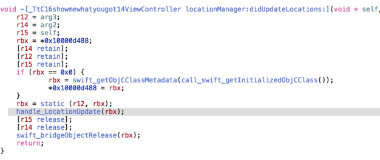
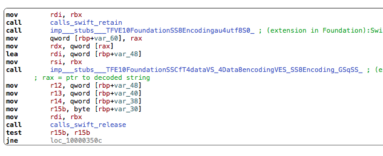

## LabyREnth CTF 2017
# Mobile 3 : showmewhatyougot

We are provided with an iOS App this time.

This challenge tests your ability to use the iOS Simulator and debug it using lldb.

First, setup the environment to run the app in.

- MacOS 10.12 VM or Host Machine (requirement for iOS 10.3)
- iOS 10.3 Simulator (Installed together with XCode)

Once the simulator is up and running, issue the following command to install the app

> xcrun simctl install booted \<path to showmewhatyougot.app\>

Launch the app and the app should exit after awhile.  
Also the app asks for Location permission, this can be a hint to what to lookout for in the code.

Time to disassemble the app and see what it is doing.  
The ".app" file is actually a folder.  
The actual binary is inside this folder.  
Extract it and throw it inside your preferred disassembler.  
I used Hopper instead of IDA Pro as it is much better at handling Apple binaries.

All memory locations mentioned below are offsets from the base address.  
Also, I've renamed some of the functions in the screenshots to better reflect what they do

There are 3 main events in this app, each with its own Event Handler
- UpdateLocation Event (didUpdateLocations)



- SubmitBtnClick Event (SubmitButton)


- MemoryWarning Event (didReceiveMemoryWarning)


Each of this handler then calls into their own respective Handler Function highlighted above

Also, all strings are obfuscated in this app

[deobfus.php](deobfus.php) deobfuscates them using the following algorithm  
- Base64-Decode
- Single Byte Xor with a given Key

The Strings in the app are base64-decoded and passed to the single byte xor function @ 0x74f0

An example is shown in the below screenshots


Loads the obfuscated string



Base-64 decodes it


Xor decrypt it with the specified key

You can now use a debugger (lldb) and set breakpoints at the handler function locations mentioned before to figure out what they do. My previous [labyREnth 2016 writeup here](https://github.com/gray-panda/grayrepo/tree/master/2016_labyREnth/mob5_ioga) shows an easy way to figure out breakpoints in iOS Simulator.

This is what each of the handler functions do.

**UpdateLocation Event (Handler Function @ 0x7810)**
- Checks if the Latitude and Longtitude are at certain values
  - Latitude: 37.234332
  - Longtitude: -115.806663
- If they are not at the value, Exit the application with "sys.exit(0)"

**SubmitBtnClick Event (Handler Function @ 0x2ea0)**
- Checks certain device configuration to be of certain values
  - CurrentDevice.Name = RicksPhone
  - CurrentDevice.Model = iPad
  - CurrentDevice.BatteryLevel = 0.1
  - Location.Latitude = 37.234332
  - Location.Longtitude =  -115.806663
- Regardless of whether the value matches or not, it will display the following message in a LabelBox
  - "Boo! Not Coo!"

It seems that these values are important. Let's match them first
- Latitude and Longtitude can be set through the iOS Simulator (Debug -> Location -> Custom)
  - Use/Setup a iOS Simulator as an iPad (I used the default "iPad 5th Gen" simulator)
  - Change my Mac's computer name to "RicksPhone"
    - CurrentDevice.Name does not take the name from the name of the Simulator.
    - Instead, it always takes my Macbook's Computer name.
  - Unfortunately, Battery Level cannot be set.

**MemoryWarning Event (Handler Function @ 0x1b30)**
- Creates a String using the following values (StrA)
  - Latitude + Model + Name
    - Correct value is "37.234332iPadRicksPhone"
- Creates a String using the following values (StrB)
  - Longtitude + LocalizedModel + BatteryLevel
    - Correct value is "-115.806663iPad0.1"
- Calculates CRC32 of StrA and StrB, then concates them
  - StrA CRC32 : 23c150cd
  - StrB CRC32 : 17017b6c
    - Concat to "23c150cd17017b6c"
- Calculates CRC32 of "iPad", then concats itself with its reverse form
  - "iPad" CRC32 : 3defb682
    - Concat to "3defb682286bfed3"
- Each of these concatenated strings are used to initialize an AES instance
  - Not sure which is used to decrypt which
- 3 encrypted strings are then decrypted using these AES instances.
- Takes the user input from the input text box and encrypts it using the same AES instance
  - Checks that the encrypted result is the same as the encrypted blob stored in the app.
  - Displays the message "I LIKE WHAT YOU GOT. GOOD JOB." if it is the same.

Combining the 3 decrypted strings will give us the flag.  
The flag is never displayed on the UI, therefore one must use lldb and the simulator to get the flag.

### How to get the flag in iOS Simulator + lldb

Set all the config values that we discussed above except BatteryLevel  
Launch a cmd prompt and lldb

```bash
> lldb
lldb> settings set target.x86-disassembly-flavor intel
lldb> process attach -n "showmewhatyougot" --waitfor
```

Launch the app within the iOS Simulator  
Set breakpoints in lldb to change the returned BatteryLevel to "0.1"

```bash
lldb> image list
```

- Copy the base address of "showmewhatyougot" app. Should be the first entry.


```bash
lldb> break set -a <base>+0x1f2e
lldb> c
```

- Trigger the breakpoint
  - Type "153dc54a34644c05c9c590ba365c2069" into the TextBox
    - You will understand why this string when you finish reading this writeup.
  - Trigger MemoryWarning (Hardware -> Simulate Memory Warning)

- The app should pause at the following function call

```
showmewhatyougot`___lldb_unnamed_symbol5$$showmewhatyougot:
->  0x10740af2e <+1022>: call   0x10740d4c0               ; ___lldb_unnamed_symbol58$$showmewhatyougot
    0x10740af33 <+1027>: mov    qword ptr [r15 + 0x98], rax
    0x10740af3a <+1034>: mov    qword ptr [r15 + 0xa0], rdx
    0x10740af41 <+1041>: mov    qword ptr [r15 + 0xa8], rcx
```

- Step over it. The BatteryLevel string will be in $rax and it's strlen is in $rdx

```bash
lldb> ni
lldb> reg read $rdx
    rdx = 0x0000000000000004
lldb> x/1s $rax
    0x600000248bd0: "-1.0faces"
```

- Therefore, the returned value is "-1.0". 
- Change it to "0.1". Copy $rax value. (In this case, it is 0x600000248bd0)

```bash
lldb> memory write -s 4 0x600000248bd0 0x00312e30
    - "-s 4" means write 4 bytes. 0x00312e30 is "0.1" in the correct endian form.
lldb> reg write $rdx 0x3
    - Change the length in $rdx to 3
```

There are 3 decryption calls @ 0x258b, 0x25c5 and 0x2611.  
Set breakpoints at all the calls

```bash
lldb> break set -a <base>+0x258b
lldb> break set -a <base>+0x25c5
lldb> break set -a <base>+0x2611
lldb> c
```

The breakpoint should trigger immediately

```
->  0x10978758b <+2651>: call   0x10978cfe2               ; symbol stub for: CryptoSwift.AES.decrypt 
    0x109787590 <+2656>: mov    qword ptr [rbp - 0x50], rax
    0x109787594 <+2660>: cmp    qword ptr [rbp - 0x30], 0x0
    0x109787599 <+2665>: jne    0x109787beb               ; <+4283>
```

All the inputs have been converted to some kind of arrays or collections.  
Is not immediately visible if you inspect the input arguments

Step over and view the results in $rax  
The results is stored in some kind of structure  
Result length is in $rax+0x10 and actual result is in $rax+0x20

```bash
lldb> ni
lldb> x/10gx $rax
    0x600000243ea0: 0x00007fc09970d9b8 0x0000000200000004
    0x600000243eb0: 0x0000000000000004 0x0000000000000020
    0x600000243ec0: 0xb00000007b4e4150 0x000000010c78a860
    0x600000243ed0: 0x000000010c787e00 0x0000000000000001
    0x600000243ee0: 0x0000000000000000 0x0000000000000002
lldb> x/1s $rax+0x20
    0x600000243ec0: "PAN{"
```

Continue to the next decryption call

```bash
lldb> c
->  0x1097875c5 <+2709>: call   0x10978cfe2               ; symbol stub for: CryptoSwift.AES.decrypt 
    0x1097875ca <+2714>: mov    qword ptr [rbp - 0x60], rax
    0x1097875ce <+2718>: cmp    qword ptr [rbp - 0x30], 0x0
    0x1097875d3 <+2723>: jne    0x109787c09               ; <+4313>
```

Step over and view results in $rax

```bash
lldb> ni
lldb> x/10gx $rax
    0x6000002877b0: 0x00007fc09970d9b8 0x0000000200000004
    0x6000002877c0: 0x0000000000000020 0x0000000000000060
    0x6000002877d0: 0x6134356364333531 0x3530633434363433
    0x6000002877e0: 0x6162303935633963 0x3936303263353633
    0x6000002877f0: 0x0000600000421820 0x0000000000000000
lldb> x/1s $rax+0x20
    0x6000002877d0: "153dc54a34644c05c9c590ba365c2069 \x18B"
```

Take note, the actual result is only 0x20 bytes long which is "153dc54a34644c05c9c590ba365c2069"  
Continue to next decryption call

```bash
lldb> c
->  0x109787611 <+2785>: call   0x10978cfe2               ; symbol stub for: CryptoSwift.AES.decrypt 
    0x109787616 <+2790>: mov    qword ptr [rbp - 0xd8], rax
    0x10978761d <+2797>: cmp    qword ptr [rbp - 0x30], 0x0
    0x109787622 <+2802>: jne    0x109787c30               ; <+4352>
```

Step over and view results in $rax

```bash
lldb> ni
lldb> x/10gx $rax
    0x6080002429d0: 0x00007fc09970d9b8 0x0000000200000004
    0x6080002429e0: 0x0000000000000001 0x0000000000000020
    0x6080002429f0: 0x000000000000007d 0x0000000000000000
    0x608000242a00: 0x000000010c787e00 0x0000000000000000
    0x608000242a10: 0x0000000000000000 0x0000000000000000
lldb> x/1s $rax+0x20
    0x6080002429f0: "}"
```

Combining the 3 decrypted strings gives the flag **PAN{153dc54a34644c05c9c590ba365c2069}**