## Flare-On CTF 2024
# Challenge 09 : serpentine

```
A good career for you would be a sort of cyber Indiana Jones. 
Imagine a lone figure, a digital explorer, ventures into the depths of the bit forest, a sprawling, tangled expanse of code and data. 
The air crackles with unseen energy, and the path ahead twists and turns like a serpent's coil. 
At the heart of this forest lies the serpent's sanctum, a fortress of encrypted secrets. 
Your mission is to infiltrate the sanctum, navigate its defenses, and retrieve the hidden flag. 
Sounds way cooler than sitting at your desk typing things nobody cares about into a keyboard.

7zip archive password: flare
```

We are provided a 7zip file with exe binary

Running the binary shows that it is expecting some kind of key


Throwing it into IDA reveals a pretty mundane main function

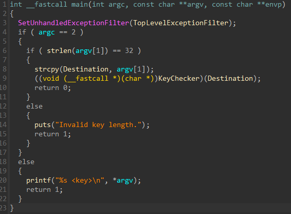

It checks that our key is 32 bytes long and passes it into a KeyChecker function  
This function is only mapped during runtime  
If you run it in a debugger, the execution will jump to somewhere in the heap and straight away hit an exception  
Another interesting point I noticed when I ran it in the debugger was that ASLR seems to be disabled  
You will understand why later

It looks like this is a challenge related to exception handling  
The next step is to find where is the exception handler so that I can put a breakpoint inside it
## Pre-main Functions

I started to look at the pre-main functions and found 2 interesting ones

First, there is a **TLSCallback** function (TLS is ThreadLocalStorage)  
TLSCallback is normally a callback function that is executed when a thread is started


It allocated the previously identified "KeyChecker" function and copy and bunch of seemingly "Encrypted" payload into it  
This payload is where the first exception was hit previously

The second interesting function is in the **[initterm](https://learn.microsoft.com/en-us/cpp/c-runtime-library/reference/initterm-initterm-e?view=msvc-170)** function

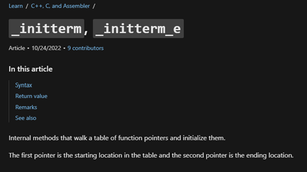

It walks through a list of function pointers and run them, it is normally used to perform initialization


It basically tries to find the function address of [RTLInstallFunctionTableCallback](https://learn.microsoft.com/en-us/windows/win32/api/winnt/nf-winnt-rtlinstallfunctiontablecallback) and then invoke it


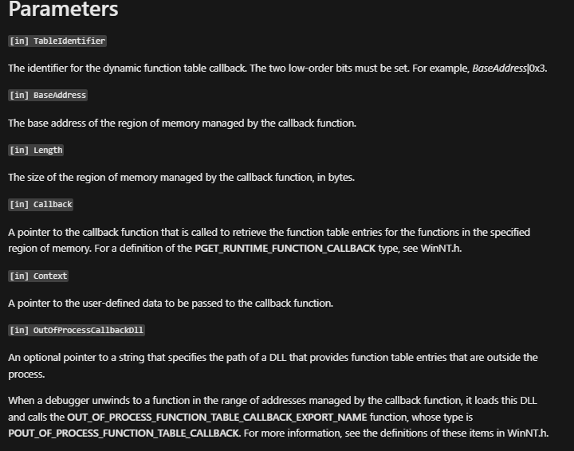

This function basically installs an exception handler for a specific memory region  
In this case, we assigned a exception handler that is in charge of the previously allocated region on the heap  
This is where I can put a breakpoint to figure out what the exception handler was doing

## Exception Handler

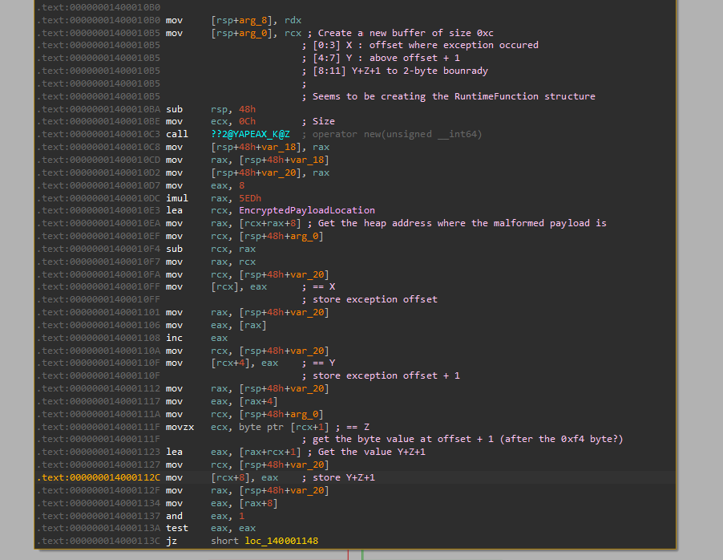

The exception handler seems to be creating some kind of structure  
If you read the MSDN documentation above closer, the "Callback" parameter is used to retrieve some type of RUNTIME_FUNCTION  

Turns out, RUNTIME_FUNCTION is a structure

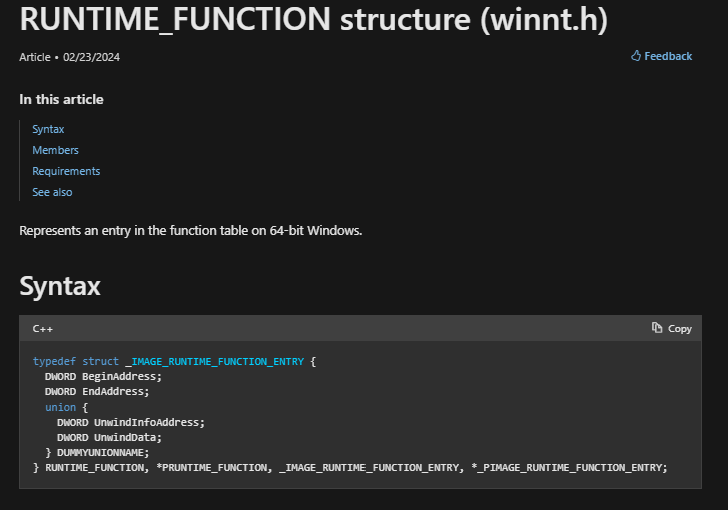

This is exactly what the exception handler is creating  
It does the following

```
Let's call the address where the exception took place as ExceptionAddr
BeginAddress = ExceptionAddr
EndAddress = ExceptionAddr+1
Z = [ExceptionAddr+1]  // read the byte at that address
UNWIND_INFO = ExceptionAddr+1+Z + some padding to a even byte boundary
```

Assigning the correct type, makes the decompiled code looks much nicer


The **[UNWIND_INFO](https://learn.microsoft.com/en-us/cpp/build/exception-handling-x64?view=msvc-170)** structure can contain more exception handler pointers  
It is normally used to unwind the stack during exceptions, to restore it to a operable state


Let's look at an example in our "Encrypted" payload  
I extracted the whole region into a separate file such that the address offset can be easily compared to the debugger later


At offset 0x48 is the UNWIND_INFO structure


According to the MSDN documentation, the first byte of the UNWIND_INFO_HDR contains the Version and a flag 

```
9 = binary 0000 1001
001 = Version
00001 = Flag = 1
```

Let's look at more MSDN documentation about the [Flag](https://learn.microsoft.com/en-us/windows/win32/api/winnt/nf-winnt-rtlvirtualunwind)

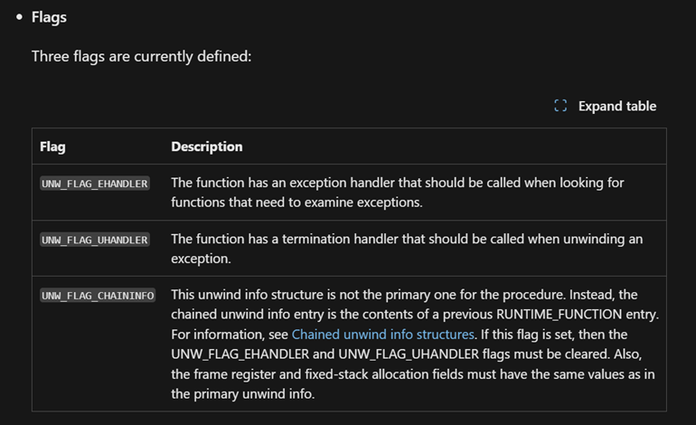
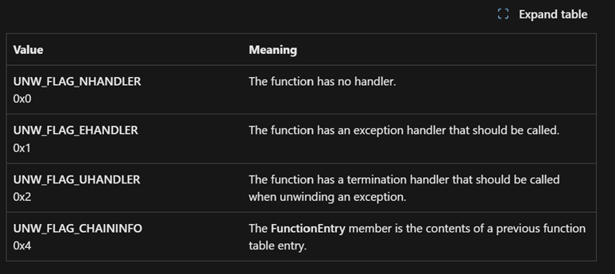

The flag of 1 means there is an exception handler after the structure  
In this case, at the offset 0x98  

I can then put a breakpoint there to see what that exception handler does  
Before I talk about what this "Inner Exception Handler" does, the structure here can also be in this pattern

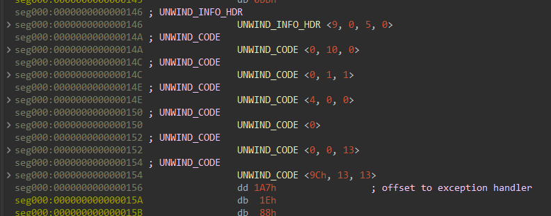

The 3rd byte of the UNWIND_INFO_HDR specifics how many UNWIND_CODE chunks there are after the header  
According to MSDN documentation, the number of UNWIND_CODE chunks will always be padded to be even  
I believe this is to make sure that it keeps to a DWORD boundary

## Inner Exception Handler

Let's resume the tracing of our first exception


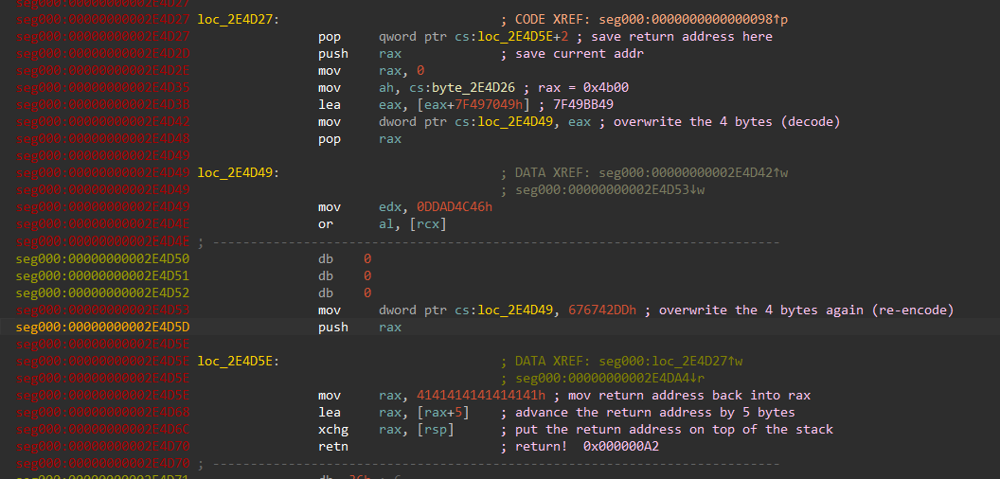

This is the main trick of this challenge  
It will overwrite 4 bytes in itself, execute it, then re-overwrite them back to gibberish  

Notice at address 2e4d49, the instruction is gibberish at the moment  
If we overwrite the 4 bytes, it becomes proper instruction

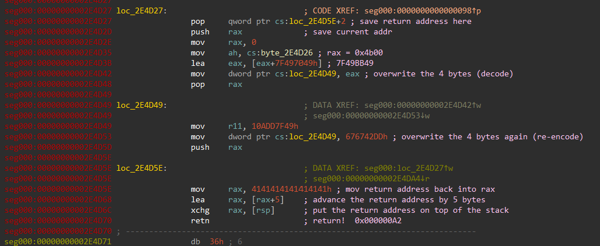

You can keep tracing from the return  
It will either go into another of this decoding/reencoding chunk or jump to another exception triggering instruction which will trigger the exception handler all over again  
This is how the code obfuscates it's instructions and is repeated many many times
## Manual Tracing

I tried to manually trace this in a debugger but soon gave up  
I traced about 0x1000 offset and it was still checking the first character  
I found that it took a byte from our input key (the fifth byte), multiply it with some constant, then using the result as indexes into some arrays  

It was extremely painful to do this manually, I looked for a way to trace this automatically  
I wanted a way where it could run the binary and just print out all the instructions that were executed

## Python Debugger (py3dbg)

A friend recommended the [py3dbg](https://pypi.org/project/py3dbg/)project to me  
This project provides a Python interface to debug x64 binaries, allowing me to program and automate the debugging process to a certain extent

Unfortunately, this project is not very well maintained.  
After fixing up some Python 3 type errors, I was able to get it to run
### Where to breakpoint?

The goal is to somehow step through the exception handler described in the previous section  
However, the exception handler's memory is allocated at runtime, I cannot hardcode this location    
I wanted to find which part of the code actually jumps to the exception handler code

Put a breakpoint at the first exception handler code block (offset 0x98 in the allocated block)


Look at the stack and take note of the return address


Go to that address in the disassembler, we are interested in the location of the "call rax" instruction


Take note that this address is within ntdll  
This means that the address will be different on your machine and between reboots because of Kernel ASLR

For my purpose, I can just hardcode this address into my py3dbg script  
Remember, if you reboot your machine, you will need to find this address again
### py3dbg script

With that address, I can put a breakpoint there using py3dbg  
py3dbg is used to single step through the entire program and print out every instruction that it executes  
Later on, I also added code that would print out the contents of registers that were involved in the instruction

Here is the [py3dbg script](steptrace.py) that I used  

```python
import py3dbg
import py3dbg.defines
import time
import sys
import hashlib

PROCESS_NAME = b"serpentine.exe"

trace_counter =0
instructions=""

def grab_registers(instruction, dbg):
    statement = ""
    if "rbp" in instruction:
        rbp = dbg.context.Rbp
        statement = f"{statement} rbp:{rbp:x}"
    if "ax" in instruction or "ah" in instruction or "al" in instruction:
        rax = dbg.context.Rax
        statement = f"{statement} rax:{rax:x}"
    if "bx" in instruction or "bh" in instruction or "bl" in instruction:
        rbx = dbg.context.Rbx
        statement = f"{statement} rbx:{rbx:x}"
    if "cx" in instruction or "ch" in instruction or "cl" in instruction:
        rcx = dbg.context.Rcx
        statement = f"{statement} rcx:{rcx:x}"
    if "dx" in instruction or "dh" in instruction or "dl" in instruction:
        rdx = dbg.context.Rdx
        statement = f"{statement} rdx:{rdx:x}"
    if "r8" in instruction:
        r8 = dbg.context.R8
        statement = f"{statement} r8:{r8:x}"
    if "r9" in instruction:
        r9 = dbg.context.R9
        statement = f"{statement} r9:{r9:x}"
    if "r10" in instruction:
        r10 = dbg.context.R10
        statement = f"{statement} r10:{r10:x}"
    if "r11" in instruction:
        r11 = dbg.context.R11
        statement = f"{statement} r11:{r11:x}"
    if "r12" in instruction:
        r12 = dbg.context.R12
        statement = f"{statement} r12:{r12:x}"
    if "r13" in instruction:
        r13 = dbg.context.R13
        statement = f"{statement} r13:{r13:x}"
    if "r14" in instruction:
        r14 = dbg.context.R14
        statement = f"{statement} r14:{r14:x}"
    if "r15" in instruction:
        r15 = dbg.context.R15
        statement = f"{statement} r15:{r15:x}"
    if "rsi" in instruction:
        rsi = dbg.context.Rsi
        statement = f"{statement} rsi:{rsi:x}"
    if "rdi" in instruction:
        rdi = dbg.context.Rdi
        statement = f"{statement} => rdi:{rdi:x}"
    return statement
    
previousInstruction = ""
def stepTrace(dbg):
    global trace_counter, instructions, previousInstruction
    rip = dbg.context.Rip
    instruction = dbg.disasm(rip)  # Disassemble the instruction at the current address
    
    if(rip <= 0x7A379E1):
        trace_counter = trace_counter + 1
        previous = grab_registers(previousInstruction, dbg)
        previousInstruction = instruction
        instructions = instructions + instruction
        statement = f"Instruction at 0x{rip:X}: {instruction}, "
        statement2 = grab_registers(instruction, dbg)
        
        print(f"\t prev : {previous}\n")
        statement = f"{statement} => {statement2}"
        print(statement)
        dbg.single_step(1)
    return py3dbg.defines.DBG_CONTINUE
    
def bp_beforejumprax(dbg):
    rip = dbg.context.Rip
    rax = dbg.context.Rax
    instruction = dbg.disasm(rip)  # Disassemble the instruction at the current address
    return py3dbg.defines.DBG_CONTINUE
    
def md5_hash_string(input_string):
    return hashlib.md5(input_string.encode()).hexdigest()

def bp_wrong(dbg):
    rip = dbg.context.Rip
    rax = dbg.context.Rax
    instruction = dbg.disasm(rip)  # Disassemble the instruction at the current address
    print("\n************************************************************trace_counter: 0x{:X}\n".format(trace_counter))
    return py3dbg.defines.DBG_CONTINUE

# Input Byte String
inputKey = bytearray(b"ABCDEFGHIJKLMNOPQRSTUVWXYZ123456")
print(f"Attempting InputKey {inputKey}")

dbg = py3dbg.pydbg()
dbg.load(PROCESS_NAME, inputKey)
dbg.attach(dbg.pid)

# 00007FFEFA090000
# 00007FFEFA13517D
# Offset - 0xA517D
dbg.bp_set(0x7FFEFA13517D ,handler=bp_beforejumprax)   # Very important, need to get from stack trace at first exception handler
dbg.bp_set(0x1400011F0 ,handler=bp_wrong)
dbg.set_callback(py3dbg.defines.EXCEPTION_SINGLE_STEP,stepTrace )
dbg.run()
    
```

I then run it like so

```
PS> python .\steptrace.py | sls "PDBG_LOG" -NotMatch | Out-File phase1.txt
```

The result will look something like so

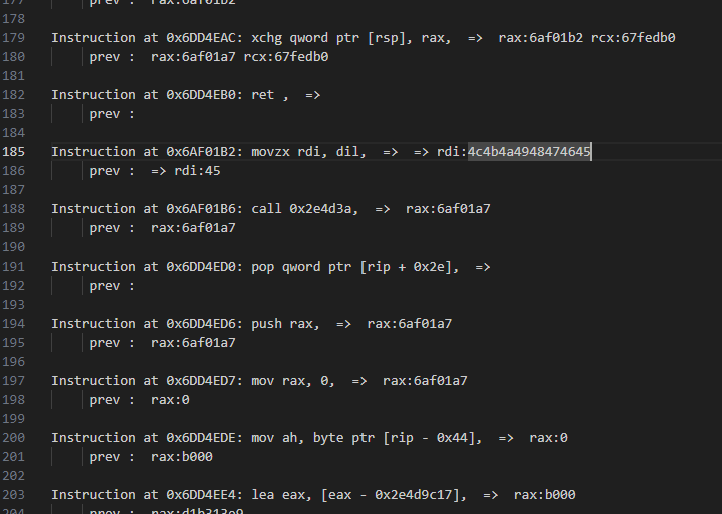

After identifying some patterns of instructions, I also wrote the following python script to remove most of the decoding/re-encoding code blocks  
This will help me focus on the more important instructions

Take note to first convert the previous text output file to UTF-8 encoding first

```python
# Remember to convert the input phase file to UTF-8 encoding
FILENAME = "phase1.txt"
OUTPUT_FNAME = "phase1-good.txt"

with open(FILENAME, "r") as f:
    data = f.read()

lines = data.split("\n\n")

with open(OUTPUT_FNAME, "w") as outfile:
    todiscard = False
    for line in lines:
        tmp = line.split(": ")
        if len(tmp) == 1:
            outfile.write(line)
            continue

        cur = tmp[1]
        if not todiscard:
            if cur.startswith("call "):
                outfile.write(line + "\n")
                todiscard = True
                continue
            elif cur.startswith("mov dword ptr [rip -"):
                todiscard = True
                continue

        if todiscard:
            if cur.startswith("pop rax,"):
                outfile.write("...\n")
                todiscard = False
                continue
            elif cur.startswith("ret ,"):
                outfile.write("...\n")
                todiscard = False
                continue
            elif cur.startswith("push rax"):
                outfile.write("xxx\n")
                outfile.write(line+"\n")
                continue

        if not todiscard:
            outfile.write(line + "\n")
```

With this method, it greatly sped up my debugging speed as I no longer need to manually debug the program
## Arithmetic Tables

With the generated trace, I could better understand what the code is trying to do  
Remember those arrays that I mentioned earlier, it was referenced repeatedly multiple times throughout the trace


These addresses in the 0x1400----- range seems to be hardcoded and is pointing back to the main binary  
This is the main reason why ASLR is disabled, as these addresses are hardcoded in the EncodedPayload  

Analyzing these addresses in IDA, I finally realized that they were pre-computed arithmetic tables  

```
Normally, we perform an add operation using the instruction
	add 0x41, 0x56

Instead, this binary performs it by referencing pre-computed arithmetic tables
	 mov reg, addtable[0x41][0x56]
	 and then moving that result back into the correct memory position
```

Here are the tables


```
Precomputed Arithmetic tables
1400962C0 - AddCarry Table
140095AC0 - Add Table
1400972c0 - MinusCarry Table
140096AC0 - Minus Table
140094AC0 - Xor Table
1400952c0 - or table
1400942C0 - and table

For add and minus operations, they have to compute for the carry bit as well
```

## Processing Loop

With this understanding, I can better analyze what the code is doing  
This is roughly how the processing loop goes

It first extracts a byte from our key and multiply it by some constant (this constant is different for every byte)
```
...
Instruction at 0x6AF01B2: movzx rdi, dil,  =>  => rdi:4c4b4a4948474645
	prev:  => rdi:45
...
Instruction at 0x6AF02BB: push r10,  =>  r10:ef7a8c
	prev:  r10:ef7a8c
Instruction at 0x6AF02BD: mul qword ptr [rsp],  => 
	prev: 
Instruction at 0x6AF02C1: mov rbp, rax,  =>  rbp:67fd8b0 rax:408c07bc
	prev:  rbp:408c07bc rax:408c07bc
...
```

Then, it performs arithmetic operation on the multiplication result  
Bytes are often extracted using a **movzx** instruction, I used that to jump around the code  
Pointers to the arithmetic tables are normally built using a **movabs** followed by a **add** and then a **mov**
```
...
Instruction at 0x6AF05AE: movzx rbx, bl,  =>  rbx:408c07bc
	prev:  rbx:bc
...
Instruction at 0x6DD54AE: movabs r14, 0xd4431f4b,  =>  r14:67f99b0
	prev:  r14:d4431f4b
...
Instruction at 0x6DD5519: add r14, 0x6bc64375,  =>  r14:d4431f4b  
	prev:  r14:1400962c0 (this is the arithmetic table)
...
Instruction at 0x6DD5585: mov r14, qword ptr [r14 + 0x468],  =>  r14:1400962c0   
	prev:  r14:1400621c0
```

```
...
Instruction at 0x6DD7526: movabs rdi, 0x119814b1a,  =>  => rdi:0
	prev:  => rdi:119814b1a
...
Instruction at 0x6DD7594: add qword ptr [rsp + 0x20], 0x26880fa6,  => 
	prev: 
...
Instruction at 0x6DD76D7: mov rdi, qword ptr [rdx + 0xc0],  =>  rdx:67e94b0 => rdi:0
	prev:  rdx:67e94b0 => rdi:1400690c0
```

The result is then put back in place using either of these methods  
The LSB is normally just mov back into place like so

```
Instruction at 0x6AF08F6: mov bpl, byte ptr [r11],  =>  r11:14006217c
	prev:  r11:14006217c
Instruction at 0x6AF08F9: mov dil, bpl,  => 
	prev: 
```

For the rest, its shifted and or-ed into place
```
Instruction at 0x6AF0F4D: shl r14, 8,  =>  r14:ff
	prev:  r14:ff00
Instruction at 0x6AF0F51: not r14,  =>  r14:ff00
	prev:  r14:ffffffffffff00ff
Instruction at 0x6AF0F54: and rbp, r14,  =>  rbp:408c0849 r14:ffffffffffff00ff
	prev:  rbp:408c0049 r14:ffffffffffff00ff
Instruction at 0x6AF0F57: movzx r14, r15b,  =>  r14:ffffffffffff00ff r15:67f2c65
	prev:  r14:65 r15:67f2c65
Instruction at 0x6AF0F5B: shl r14, 8,  =>  r14:65
	prev:  r14:6500
Instruction at 0x6AF0F5F: or rbp, r14,  =>  rbp:408c0049 r14:6500
	prev:  rbp:408c6549 r14:6500
```

The following is a rough summary of the processing loop  
The arithmetic operations are performed on 8-byte numbers
```
movzx to extract 1st input byte
mul with a constant
Perform 1 arithmetic operation using the Arithmetic Table (Could be add, minus, xor, and, or)
	During this, movzx will be used to extract each byte for the arithmetic operation
	
Then loop the following until 8 bytes are checked
	movzx to extract next input byte
	mul with a constant
	Perform 1 arithmetic operation with this mul result and the previous result, using instructions (NOT through the arithmetic table)
	Perform another arithmetic operation using the Arithmetic table

After looping over 8 bytes,
	The result is subtracted by some constant to get the FinalResult

This FinalResult is checked to be equal to 0 (through a "test reg, reg" instruction)
If the FinalResult is not 0, it jumps to the PrintWrongKey function

Otherwise it continues to more code
```

The processing loops combines 8 bytes of our input through arithmetic operations and checks it against a target number  
This is equivalent to hashing these 8 bytes and checking the result against a target hash  
It then continues to more code if it matches  
## Phase 1 & Cracking the hash

Here is a summary of the math for this phase of checks  
I used the test input "ABCDEFGHIJKLMNOPQRSTUVWXYZ123456"

```
------------- Phase 1 ----------------
01234567890123456789012345678901
ABCDEFGHIJKLMNOPQRSTUVWXYZ123456

input[4]  'E' 0x45 * EF7A8C = 408C07BC + 9d865d8d = DE126549
input[24] 'Y' 0x59 * 45b53c = 183C01DC
DE126549 - 183C01DC = C5D6636D + 18baee57 = DE9151C4
input[0]  'A' 0x41 * E4CF8B = 3A18B24B
DE9151C4 - 3A18B24B = A4789F79 - 913fbbde = 1338E39B
input[8]  'I' 0x49 * f5c990 = 46167A10
1338e39b - 46167A10 = ffffffffcd22698b + 6bfaa656 = 391d0fe1
input[20] 'U' 0x55 * 733178 = 263F6CD8
391d0fe1 ^ 263F6CD8 = 1F226339 ^ 61e3db3b = 7EC1B802
input[16] 'Q' 0x51 * 9a17b8 = 30C18138
7EC1B802 ^ 30C18138 = 4E00393A - ca2804b1 = FFFFFFFF 83D83489
input[12] 'M' 0x4D * 773850 = 23DBF010
ffffffff83d83489 ^ 23DBF010 = FFFFFFFFA003C499 ^ 5a6f68be = FFFFFFFF fa6cac27
input[28] '3' 0x33 * e21d3d = 2D0BD327
fffffffffa6cac27 ^ 2D0BD327 = ffffffffd7677f00 ^ 5c911d23 = ffffffff8bf66223
ffffffff8bf66223 - ffffffff81647a79 = 0A91E7AA
0A91E7AA | 00**00******00** = 0A91E7AA  (they just or with 0s, does not change anything)

test 0A91E7AA (that means this result must be 0)
To make the final test be 0, the target number is ffffffff81647a79
```

Brute-forcing 8 bytes is not feasible.  
Is there an easier way to crack this hash?
### MITM (Meet-In-The-Middle)

Analyzing the math, I realized that a [meet-in-the-middle attack](https://en.wikipedia.org/wiki/Meet-in-the-middle_attack) is possible  
I could break the math operation into half and check that the results of both halves are equal  

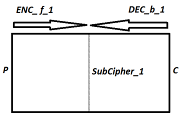

Instead of a 8-byte brute force, I only need to perform 2 4-byte brute force, drastically reducing the search space

With some help from ChatGPT, I wrote the following python script  
The difficult part was writing the reverse mathematical operations for the "right" function  
I was generating for the full ASCII range (excluding spaces)

```python
import itertools

def left(E, Y, A, I):
    tmp = ((E * 0xEF7A8C) + 0x9d865d8d) & 0xffffffffffffffff
    tmp2 = Y * 0x45b53c
    tmp = (tmp - tmp2 + 0x18baee57) & 0xffffffffffffffff
    tmp2 = A * 0xE4CF8B
    tmp = (tmp - tmp2 - 0x913fbbde) & 0xffffffffffffffff
    tmp2 = I * 0xf5c990
    tmp = (tmp - tmp2 + 0x6bfaa656) & 0xffffffffffffffff
    return tmp

def right(U, Q, M, Three):
    tmp = 0xffffffff81647a79 ^ 0x5c911d23
    tmp2 = Three * 0xe21d3d
    tmp = (tmp ^ tmp2 ^ 0x5a6f68be) & 0xffffffffffffffff
    tmp2 = M * 0x773850
    tmp = ((tmp ^ tmp2) + 0xca2804b1) & 0xffffffffffffffff
    tmp2 = Q * 0x9a17b8
    tmp = (tmp ^ tmp2 ^ 0x61e3db3b) & 0xffffffffffffffff
    tmp2 = U * 0x733178
    tmp = (tmp ^ tmp2) & 0xffffffffffffffff
    return tmp

def get_generator():
    res = itertools.product(range(33,127) ,repeat=4)
    for guess in res:
        yield guess

def main():
    left_generator = get_generator()
    right_generator = get_generator()

    left_results = {}
    right_results = {}
    counter = 0

    print("Generating Left")
    for guess in left_generator:
        counter += 1
        if counter % 10000000 == 0:
            print("%s %d" % ("Still generating left", counter))
            
        tmp_left = left(guess[0], guess[1], guess[2], guess[3])
        left_results[tmp_left] = guess

    print("Generating Right")
    for guess in right_generator:
        counter += 1
        if counter % 10000000 == 0:
            print("%s %d" % ("Still generating right", counter))

        tmp_right = right(guess[0], guess[1], guess[2], guess[3])
        right_results[tmp_right] = guess

    print("Matching...")
    with open("matches1.txt", "w") as matchfile:
        for left_sum, left_guess in left_results.items():
            counter += 1
            if counter % 10000000 == 0:
                print("%s %d" % ("Still matching", counter))

            if left_sum in right_results:
                right_guess = right_results[left_sum]
                total_guess = left_guess + right_guess
                outchars = ""

                for x in total_guess:
                    outchars += chr(x)
                # print("Match Found: \"%s\"" % outchars)
                matchfile.write(outchars+"\n")
    print("Done")

if "__main__" == __name__:
    main()
```

This generated about 600K candidates  
Using 1 of them in my Python Debugger passed the first test and unlocked more code!!
## Phase 2, 3, 4

You can see these trace files in this [zip file](traces.zip)

The additional code basically does more of the same thing but its checking a different 8 byte set of our 32 byte input key  
I repeated the same process for these 4 phases  
This process of decoding the math is extremely time consuming and hence why this challenge took so much time

Here are their math

```
------------- Phase 2 ----------------
01234567890123456789012345678901
2BCD4FGHpJKL0NOPERSTOVWX1Z12D456

input[17] 'R' 0x52 * 99aa81 = 31389D52 - 74edea51 = ffffffffbc4ab301
input[5]  'F' 0x46 * 4aba22 = 146EE54C
ffffffffbc4ab301 ^ 146EE54C = ffffffffa824564d + 598015bf = 1A46C0C
input[21] 'V' 0x56 * 91a68a = 30EDF25C
1A46C0C ^ 30EDF25C = 31499E50 ^ 6df18e52 = 5CB81002
input[1]  'B' 0x42 * 942fde = 2634573C
5CB81002 ^ 2634573C = 7A8C473E + 15c825ee = 90546D2C

input[13] 'N' 0x4e * fe2fbe = 4D728BE4
90546D2C - 4D728BE4 = 42E1E148 + d5682b64 = 1184A0CAC
input[29] '4' 0x34 * d7e52f = 2BDA8D8C
1184A0CAC - 2BDA8D8C = EC6F7F20 + 798bd018 = 165FB4F38
input[25] 'Z' 0x5a * e44f6a = 5043EB44
165FB4F38 ^ 5043EB44 = 135B8A47C - e66d523e = 4F4B523E
input[9]  'J' 0x4a * af71d6 = 32B6E7DC
4F4B523E + 32B6E7DC = 82023A1A + 921122d3 = 114135CED
114135ced - e1148bae = 32FED13F
32FED13F | 0000******00 = 32fed13f

test 32fed13f (make this 0 to continue)


------------- Phase 3 ----------------
01234567890123456789012345678901
20CD4vGHpqKL0GOPELSTOeWX1p12De56

input[10] 'K' 0x4b * 48c500 = 1551B700 - 8fdaa1bc = ffffffff85771544
input[30] '5' 0x35 * 152887 = 46163F3
ffffffff85771544 - 46163F3 = ffffffff8115b151 + 65f04e48 = ffffffffe705ff99
input[14] 'O' 0x4f * aa4247 = 348A73E9
ffffffffe705ff99 - 348A73E9 = ffffffffb27b8bb0 ^ 3d63ec69 = ffffffff8f1867d9
input[22] 'W' 0x57 * 38d82d = 1351774B
ffffffff8f1867d9 ^ 1351774B = ffffffff9c491092 ^ 872eca8f = ffffffff1b67da1d

input[26] '1' 0x31 * f120ac = 2E2740EC
ffffffff1b67da1d ^ 2E2740EC = ffffffff35409af1 + 803dbdcf = ffffffffb57e58c0
input[2]  'C' 0x43 * 254def = 9C3658D
ffffffffb57e58c0 + 9C3658D = ffffffffbf41be4d ^ ee380db3 = ffffffff5179b3fe
input[18] 'S' 0x53 * 9ef3e7 = 338913E5
ffffffff5179b3fe ^ 338913E5 = ffffffff62f0a01b - 6deaa90b = fffffffef505f710
input[6]  'G' 0x47 * 69c573 = 1d55c2e5
fffffffef505f710 + 1d55c2e5 = ffffffff125bb9f5 - c9ac5c5d = fffffffe48af5d98
fffffffe48af5d98 - fffffffdf3ba3f0d = 54f51e8b
54f51e8b | **000000******** = 54f51e8b

test 54f51e8b (make this 0 to continue)


------------- Phase 4 ----------------
01234567890123456789012345678901
20PD4vgHpqEL0GVPELKTOeKX1p92De86

input[11] 'L' 0x4c * 67dda4 = 1ed5ccb0 + f4753afc = 1134b07ac
input[31] '6' 0x36 * 5bb860 = 1358E440
1134b07ac + 1358E440 = 126a3ebec ^ c1d47fc9 = 1e7779425
input[23] 'X' 0x58 * ab0ce5 = 3acc6eb8
1e7779425 ^ 3acc6eb8 = 1ddbbfa9d + 544ff977 = 2320bf414
input[7]  'H' 0x48 * 148e94 = 5c819a0
2320bf414 + 5c819a0 = 237d40db4 - 9cb3e419 = 19b20299b

input[15] 'P' 0x50 * 9e06ae = 31621660
19b20299b - 31621660 = 169be133b - adc62064 = bbf7f2d7
input[3]  'D' 0x44 * fb9de1 = 42d5efc4
bbf7f2d7 ^ 42d5efc4 = f9221d13 ^ 4e3633f7 = b7142ee4
input[27] '2' 0x32 * a8a511 = 20f03d52
b7142ee4 - 20f03d52 = 9623f192 ^ a61f9208 = 303c639a
input[19] 'T' 0x54 * d3468d = 45532644
303c639a + 45532644 = 758f89de + 4a5d7b48 = bfed0526
bfed0526 - ffffffffef6412a2 = d088f284
d088f284 & ff**ffffff******  (and FF does not really do anything)

test d088f284 (make this 0 to continue)
```

We now have checked through all 32 bytes of our input key  
The 8 bytes checked in each phase are all independent between the phases  
There are multiple possible candidates for each phase

```
Phase 1 :  590673 candidates
Phase 2 : 1146216 candidates
Phase 3 : 2379026 candidates
Phase 4 :  189752 candidates
```

This means there are more phases!!
## Phase 5, 6, 7

When analyzing Phase 5, I realized that it was checking the same 8 byte set as Phase 1  
This made me realized that there might be at least 8 phases in total

```
------------- Phase 5 ----------------
01234567890123456789012345678901
20P14vgopqEI0GVzELKROeKh1p9uDe89

input[12] '0' 0x30 * 640ba9 = 12c22fb0 + 516c7a5c = 642eaa0c
input[0]  '2' 0x32 * f1d9e5 = 2f3c8eba
642eaa0c - 2f3c8eba = 34f21b52 + 8b424d6b = c03468bd
input[28] 'D' 0x44 * d3e2f8 = 384849e0
c03468bd + 384849e0 = f87cb29d + 3802be78 = 1307f7115
input[24] '1' 0x31 * b558ce = 22b5ff6e
1307f7115 + 22b5ff6e = 153357083 - 33418c8e = 11ff3e3f5
input[8] 'p' 0x70 * 2f03a7 = 14919910
11ff3e3f5 - 14919910 = 10b624ae5 ^ e050b170 = 1eb32fb95
input[16] 'E' 0x45 * b8fa61 = 31db7c25
1eb32fb95 + 31db7c25 = 21d0e77ba ^ 1fc22df6 = 202cc5a4c
input[20] 'O' 0x4f * e0c507 = 455ccd29
202cc5a4c - 455ccd29 = 1bd6f8d23 ^ d8376e57 = 16558e374
input[4] '4' 0x34 * 8e354e = 1ce2d3d8
16558e374 + 1ce2d3d8 = 1823bb74c - d2cb3108 = af708644
af708644 - 100e79080 = ffffffffae88f5c4
ffffffffae88f5c4 & ****ffffff**ff** = ffffffffae88f5c4

test ffffffffae88f5c4 (make this 0 to continue)
```

As Phase 5 is checking the same byte set as Phase 1, I do not need to use the meet in the middle attack anymore  
Instead, I used the candidates from Phase 1 and pass it through this math function  
They are a match only if the result is 0

```python
def batch5(a1, a2, a3, a4, a5, a6, a7, a8):
    tmp = ((a1 * 0x640ba9) + 0x516c7a5c) & 0xffffffffffffffff
    tmp2 = a2 * 0xf1d9e5
    tmp = ((tmp - tmp2) + 0x8b424d6b) & 0xffffffffffffffff
    tmp2 = a3 * 0xd3e2f8
    tmp = ((tmp + tmp2) + 0x3802be78) & 0xffffffffffffffff
    tmp2 = a4 * 0xb558ce
    tmp = ((tmp + tmp2) - 0x33418c8e) & 0xffffffffffffffff
    tmp2 = a5 * 0x2f03a7
    tmp = ((tmp - tmp2) ^ 0xe050b170) & 0xffffffffffffffff
    tmp2 = a6 * 0xb8fa61
    tmp = ((tmp + tmp2) ^ 0x1fc22df6) & 0xffffffffffffffff
    tmp2 = a7 * 0xe0c507
    tmp = ((tmp - tmp2) ^ 0xd8376e57) & 0xffffffffffffffff
    tmp2 = a8 * 0x8e354e
    tmp = (tmp + tmp2 - 0xd2cb3108) & 0xffffffffffffffff

    return (tmp - 0x100e79080) & 0xffffffffffffffff

def match15():
    # Pass the results of matches1 into batch5, valid candidates should return 0 as well
    # Take care to rearrange the input into the correct order/position
    # m1_pos = [4, 24, 0, 8, 20, 16, 12, 28]
    # m5_pos = [12, 0, 28, 24, 8, 16, 20, 4]
    m1 = readMatches("matches1.txt")
    combine_matches = []
    for x in m1:
        tmp = batch5(ord(x[6]), ord(x[2]), ord(x[7]), ord(x[1]), ord(x[3]), ord(x[5]), ord(x[4]), ord(x[0]))
        if tmp == 0:
            print("Match Found!")
            print(x)
            combine_matches.append(x)
    return combine_matches

# Matching between Phase 1 and 5
m15 = match15()
print(m15)
```

This only produced 1 match!! Yay!! 


This is also true for Phases 6 and 7  

```
------------- Phase 6 ----------------
01234567890123456789012345678901
$0P1lvgo5qEIeGVzoLKRgeKhdp9uve89

input[17] 'L' 0x4c * a9b448 = 32618560 ^ 9f938499 = adf201f9
input[5] 'v' 0x76 * 906550 = 428eb2e0
adf201f9 + 428eb2e0 = f080b4d9 + 407021af = 130f0d688
input[13] 'G' 0x47 * aa5ad2 = 2f3f303e
130f0d688 ^ 2f3f303e = 11fcfe6b6 ^ 77cf83a7 = 168006511
input[29] 'e' 0x65 * c49349 = 4d8e1bcd
168006511 ^ 4d8e1bcd = 1258e7edc ^ 3067f4e7 = 115e98a3b
input[9] 'q' 0x71 * 314f8e = 15c41dae
115e98a3b + 15c41dae = 12bada7e9 + cd975f3b = 1f9450724
input[21] 'e' 0x65 * 81968b = 332064d7
1f9450724 ^ 332064d7 = 1ca6563f3 + 893d2e0b = 253a291fe
input[25] 'p' 0x70 * 5ffbac = 29fe1b40
253a291fe - 29fe1b40 = 229a476be ^ f3378e3a = 2da93f884
input[1] '0' 0x30 * f63c8e = 2e2b5aa0
2da93f884 - 2e2b5aa0 = 2ac689de4 - 1c1d882b = 2904b15b9

2904b15b9 - 28e5eb48d = 1ec612c
1ec612c & ff**ff**ff**ff** = 1ec612c

test 1ec612c (make this 0 to continue)


------------- Phase 7 ----------------
01234567890123456789012345678901
$$P1lwgo5_EIepVzovKRg_Khd_9uvi89

input[22] 'K' 0x4b * a6edf9 = 30e7b7f3 ^ 77c58017 = 472237e4
input[18] 'K' 0x4b * e87bf4 = 441c507c
472237e4 - 441c507c = 305e768 - 999bd740 = ffffffff696a1028
input[2]  'P' 0x50 * 19864d = 7f9f810
ffffffff696a1028 - 7f9f810 = ffffffff61701818 - 41884bed = ffffffff1fe7cc2b
input[6]  'g' 0x67 * 901524 = 39f8817c
ffffffff1fe7cc2b + 39f8817c = ffffffff59e04da7 ^ 247bf095 = ffffffff7d9bbd32
input[10] 'E' 0x45 * c897cc = 3610e9fc
ffffffff7d9bbd32 ^ 3610e9fc = ffffffff4b8b54ce ^ eff7eea8 = ffffffffa47cba66
input[14] 'V' 0x56 * 731197 = 26a7e8ba
ffffffffa47cba66 ^ 26a7e8ba = ffffffff82db52dc + 67a0d262 = ffffffffea7c253e
input[30] '8' 0x38 * 5f591c = 14db7e20
ffffffffea7c253e + 14db7e20 = ffffffffff57a35e + 316661f9 = 30be0557
input[26] '9' 0x39 * 579d0e = 1381f81e
30be0557 + 1381f81e = 443ffd75 - 3427fa1c = 10180359

10180359 - 900d744b = ffffffff800a8f0e
ffffffff800a8f0e & ff**ffffffffffff = ffffffff800a8f0e

test ffffffff800a8f0e (make this 0 to continue)
```

The results from Phase 6 and 7 only resulted in 1 possible candidate
## Phase 8

Well, I could repeat the same steps for Phase 8 to get the answer mathematically  
But to be honest, I was tired of all these math

Since Phase 4 only had about 200K candidates, I figured I could eyeball it  
I combined the result from Phase 7 and the candidates from Phase 4 as below

```python
def getValidKeys(initialKey, positions, matchFname):
    template = list(initialKey)
    output = []
  
    lines = readMatches(matchFname)
    for x in lines:
        guess = [ord(x[0]), ord(x[1]), ord(x[2]), ord(x[3]), ord(x[4]), ord(x[5]), ord(x[6]), ord(x[7])]
        for i in range(8):
            template[positions[i]] = chr(guess[i])
        # print("".join(template))
        output.append("".join(template))
        
    return output

def writeKeysToFile(validkeys, fname):
    with open(fname, "w") as f:
        for x in validkeys:
            f.write(x+"\n")

finalcand = getValidKeys("$$_1lwao5_kIep_zov1Rg_ahd_muvin9", [11, 31, 23, 7, 15, 3, 27, 19], "matches4.txt")
writeKeysToFile(finalcand, "zFinalCandidates.txt")
```

I then did some grepping to see if there are any sensible l33tspeak  
Finally, I found one that worked

> Get-Content zFinalCandidates.txt | Select-String k3ep | Select-String and

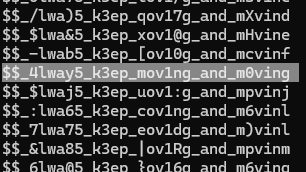

Because of the "$" character, it's easier to run it in CMD than in Powershell


The flag is **$$_4lway5_k3ep_mov1ng_and_m0ving@flare-on.com**